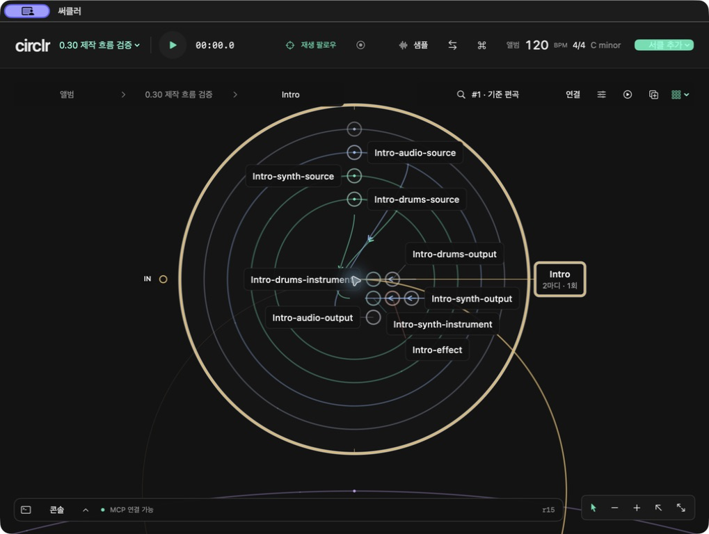
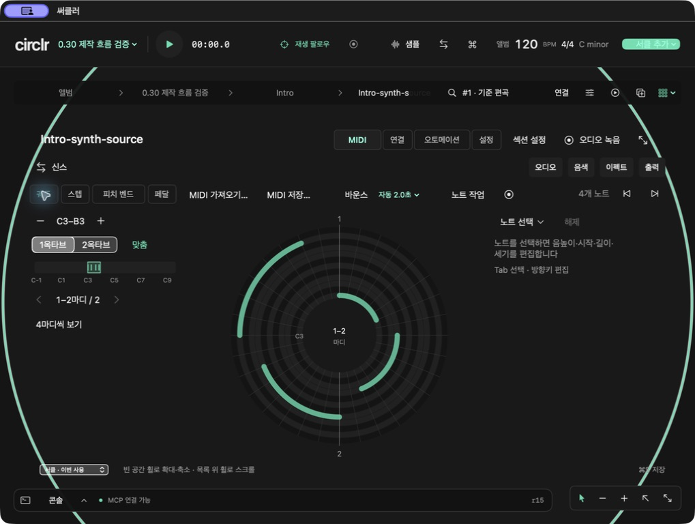

# circlr · 써클러

**송라이터와 편곡자를 위한 macOS 궤도형 음악 작업 공간.**

[English](README.md) · 한국어

[시작하기](#시작하기) · [문서](docs/README.md) · [로드맵](docs/releases/roadmap.md) · [릴리스](https://github.com/zeztto/circlr/releases)

써클러에서 원은 타임라인입니다. 섹션으로 곡을 구성하고, 그 안에 MIDI·오디오·악기·이펙터를 배치해 입출력을 연결합니다. 하나의 확대 가능한 캔버스에서 곡 전체 구성과 세부 편집을 오갑니다.



*직접 작성한 QA 프로젝트를 연 실제 개발 앱 0.30.0 build157입니다. 편집 화면이며 오디오 재생을 증명하는 화면은 아닙니다. [촬영 정보](docs/images/README.md).*

> **0.30.0 · build161.** MIT 오픈소스 프로젝트입니다. 실제 출력은 사용자 청취를 확인했으며, 한글 IME와 남은 native QA는 사용자 승인으로 유예했습니다. [검증 기록](docs/releases/0.30.0-final-qa.md).

## 할 수 있는 작업

- **송폼 설계:** 앨범·곡·섹션을 중첩된 서클로 구성하고 섹션 재사용·반복·편곡 변형을 다룹니다.
- **노드 연결:** 자유 배치·그리드·그룹·사용자 색상과 명시적인 IN/OUT을 가진 8방향 연결을 사용합니다.
- **MIDI·오디오 편집:** 원호형 노트, 드럼·신스 스텝, 피치 벤드·서스테인, 파형 트림·분할·페이드를 편집합니다.
- **음색과 움직임:** 악기·이펙트 연결, 오토메이션, 바운스·원본 복원과 재생 팔로우·시그널 시각화 기능을 다룹니다.
- **로컬 에이전트:** MCP로 프로젝트 조회·편집, MIDI 생성, 렌더링·저장을 수행하고 콘솔에서 작업을 확인합니다.



구현된 개발 기능의 목록이며 모든 오디오 장치·플러그인의 호환성을 보증하지 않습니다. 아티스트 프로필과 텍스트·이미지·영상을 함께 관리하는 도구는 [장기 목표](docs/21-artist-universe.md)입니다.

## 시작하기

Apple Silicon용 **[0.30.0 정식 릴리스](https://github.com/zeztto/circlr/releases/tag/v0.30.0)**를 내려받으세요. 공개 저장소이며 소스는 `main`에서 빌드할 수 있습니다.

컬러를 적용한 **f0r h3r v5**가 동봉됩니다. **파일 → 데모곡 불러오기…**에서 편집 가능한 사본을 여세요.

**필요 환경:** macOS 14 이상, 활성 개발자 디렉터리로 선택된 Xcode 26 이상, Python 3. 현재 native 검증 환경은 Apple Silicon입니다. 앱 UI는 한국어이며 README는 한국어와 영어로 제공합니다.

```sh
git clone --branch main https://github.com/zeztto/circlr.git
cd circlr
./scripts/build-app.sh
open 'dist/써클러.app'
```

빌드는 앱·오디오 helper 5개·에이전트 키트를 함께 패키징합니다. 로컬 패키지는 ad-hoc 서명이며 공증되지 않았습니다. 개발 버전을 시험할 때 중요한 프로젝트는 사본으로 보관하세요.

`release/0.40.0`에서 캔버스 가시성과 감상·팔로우 조작을 우선 개선하고 있습니다. [0.40 실행 계획](docs/releases/0.40.0.md)을 참고하세요. 현재 0.30 다운로드에는 이 개발 변경이 포함되지 않습니다.

## 첫 작업

1. 빈 캔버스에서 우클릭해 서클을 만듭니다. 섹션으로 곡을 설계하고 그 안에 MIDI·오디오·악기·이펙터를 추가합니다.
2. 빈 공간 위에서 휠로 확대·축소하고 서클을 두 번 클릭해 상세 화면으로 들어갑니다. 포트를 연결해 신호 경로를 정합니다.
3. 노트·스텝을 편집하거나 오디오·MIDI를 가져옵니다. 도구 모음에서 오토메이션·음색 설정으로 전환합니다.
4. **⌘S**로 `.circlr` 프로젝트를 저장합니다. **바운스**로 트랙 경로를 오디오로 만들고 **원본 복원**으로 돌아갑니다.

| 단축키 | 동작 |
|---|---|
| ⇧⌘P | 명령·단축키 검색 |
| ⌘J | 섹션·트랙·악기·이펙터로 이동 |
| Tab / ⇧Tab | 편집 컨트롤 이동 |
| Ctrl + ` | 콘솔 표시·숨기기 |
| ⌘W / ⌘Q | 창 최소화 / 앱 종료 |

## 개발자와 에이전트

[문서 안내](docs/README.md)에서 시작하세요. 기여자는 [CONTRIBUTING.md](CONTRIBUTING.md), 개발 에이전트는 [AGENTS.md](AGENTS.md)도 읽습니다. 음악 작업은 [MCP 연결](mcp/README.md)과 [스튜디오 에이전트 키트](docs/24-music-agent-kit.md)를 참고하세요.

Swift 패키지는 프로젝트 모델(`CirclrCore`), 오디오 처리(`CirclrAudio`, `CirclrRealtime`), macOS UI(`CirclrApp`)로 나뉩니다. GUI와 MCP 편집은 같은 문서 모델을 사용합니다. [아키텍처](docs/15-hierarchy-canvas-architecture.md) · [검증 절차](docs/releases/README.md).

## 개발 상태·릴리스·라이선스

완료한 버전마다 Git 태그와 GitHub Release를 만들고 한국어·영어 변경 안내, 검증한 앱 패키지, 체크섬을 제공합니다. 개발 build 번호 증가와 문서 수정은 릴리스를 만들지 않습니다. [변경 이력](CHANGELOG.md) · [릴리스 절차](docs/releases/README.md).

코드·문서·아이콘은 [MIT](LICENSE), 음악은 [별도 이용 조건](Resources/Demos/DEMO-LICENSE.md)입니다. 데모는 앱·포크와 함께 재배포할 수 있으며 곡의 별도 발매 권한은 포함하지 않습니다. 타악기 자산 6개는 CC0입니다. [라이선스 범위와 출처](THIRD_PARTY_NOTICES.md) · [기여 안내](CONTRIBUTING.md).
