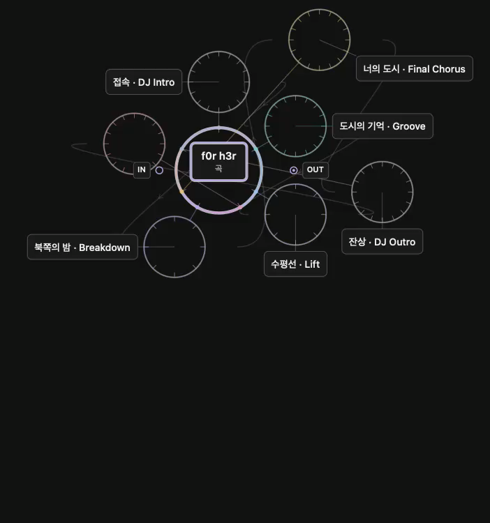
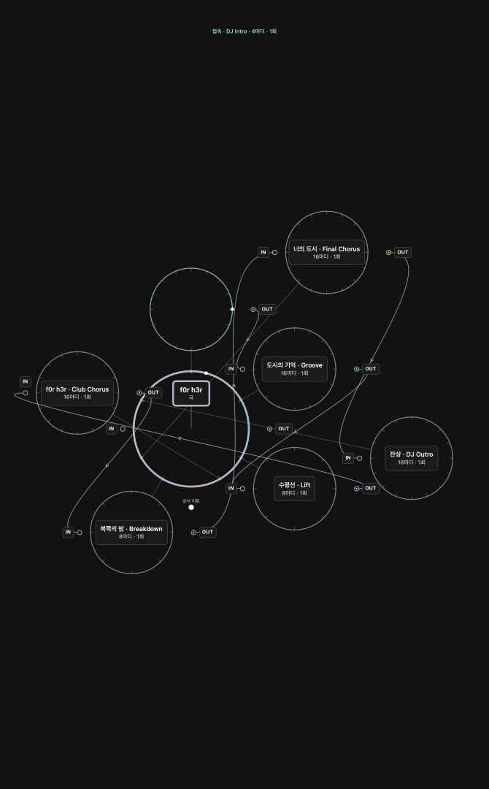

# circlr

**An orbital music workspace for songwriters and arrangers on macOS.**

English · [한국어](README.ko.md)

[Getting started](#getting-started) · [Documentation](docs/README.md) · [Roadmap](docs/releases/roadmap.md) · [Releases](https://github.com/zeztto/circlr/releases)

In circlr, a circle is a timeline. Build a song from sections, place MIDI, audio, instruments and effects on and around their orbits, and connect their inputs and outputs. Move between the whole arrangement and detailed editing on one zoomable canvas.



*0.80.0 build195 development preview: the first frame of a native-app MP4. The latest public release is still 0.70.0. [Capture provenance](docs/images/README.md).*

> **0.70.0 · build180.** Smoother playback canvas and MP4 capture in the verified scenarios, with viewing mode beside Record. [Evidence and limits](docs/releases/0.70.0-qa.md).

**In development:** [0.80.0](docs/releases/0.80.0.md) improves orbit readability and tests the complete playback, recording, editing and export path. Build207 keeps legacy recovery intact, lets a blocked MCP connection use a new endpoint, and lets an open app explicitly become the default MCP target again. It also keeps a visible MIDI/audio editor open during playback, offers job-only MCP cancellation and lets you select an app-only output device with **⌘,** if the default stalls. Its QA gates remain open; 0.70.0 is the latest release.

## What you can work with

- **Song form:** connected album, song and section timelines; reusable sections, repetitions and arrangement variations.
- **A connected canvas:** free placement, automatic layout, grids, groups, custom colors and connections around eight directions with explicit IN/OUT.
- **MIDI and audio:** orbital note editing, a drum/synth step editor, pitch bend and sustain editing, waveform trim, split and fades.
- **Sound and motion:** instrument/effect routing, automation, bounce and source restoration; playback-follow and signal visualization controls.
- **Local agents:** an MCP interface for inspecting and editing projects, generating MIDI, rendering and saving, with activity visible in the console.



*A separate build180 f0r h3r portrait capture from the latest public release. The MP4 contains the canvas, so its frame does not show the toolbar. [Capture details](docs/images/README.md).*

These are implemented development features, not a guarantee of compatibility with every audio device or plug-in. Artist profiles and a combined text, image and video workspace are the [longer-term direction](docs/21-artist-universe.md).

## Getting started

Download **0.70.0 build180** for Apple Silicon from [GitHub Releases](https://github.com/zeztto/circlr/releases/tag/v0.70.0), or build from `main` for source development.

The downloaded app is ad-hoc signed and not notarized by Apple. If macOS blocks its first launch, verify the download, then use **System Settings → Privacy & Security → Open Anyway**. [macOS installation and first launch](docs/install-macos.md#english).

The colored **f0r h3r v6** demo is included. Choose **File → 데모곡 불러오기…** to open an editable copy.

**Source build requirements:** macOS 14+, Xcode 26+ selected as the active developer directory, and Python 3. Native validation currently covers Apple Silicon. The interface is currently in Korean; this README is available in both languages.

```sh
git clone --branch main https://github.com/zeztto/circlr.git
cd circlr
./scripts/build-app.sh
open 'dist/써클러.app'
```

The build packages the app, its five audio helpers and the agent kit together. Local packages use ad-hoc signing and are not notarized. Keep a separate copy of important projects when trying development builds.

Choose a synth circle, then **음색·악기 찾기** to search the built-in patches. The same patches are available through MCP `sounds`; apply the returned `synthPatch` to `instrument.synth`. Existing saved sounds are preserved until explicitly changed. [Release notes](docs/releases/0.70.0-notes.md).

## First session

1. Right-click empty canvas space to create a circle. Add sections to plan the song, then add MIDI, audio, instruments and effects inside them.
2. Zoom with the wheel over empty canvas space; double-click a circle to enter its detail. Connect ports to define signal flow.
3. Edit notes or steps, import audio/MIDI, and use the toolbar to switch to automation or sound settings.
4. Save the `.circlr` project with **⌘S**. Use **Bounce** to turn a track path into audio and **Restore original** to return to its source.

| Shortcut | Action |
|---|---|
| ⇧⌘P | Search commands and shortcuts |
| ⇧⌘V | Enter text-free viewing mode; press Esc to leave |
| ⌘J | Jump to a section, track, instrument or effect |
| Tab / ⇧Tab | Move through editor controls |
| Ctrl + ` | Show or hide the console |
| ⌘W / ⌘Q | Minimize the window / quit the app |

## Developers and agents

Start with [the documentation map](docs/README.md). Contributors should read [CONTRIBUTING.md](CONTRIBUTING.md); coding agents should also read [AGENTS.md](AGENTS.md). For music work, see [MCP setup](mcp/README.md) and the [studio agent kit](docs/24-music-agent-kit.md).

The Swift package separates the project model (`CirclrCore`), audio processing (`CirclrAudio`, `CirclrRealtime`) and macOS interface (`CirclrApp`). GUI and MCP edits use the same document model. See [architecture](docs/15-hierarchy-canvas-architecture.md) and [verification](docs/releases/README.md).

## Status, releases and license

Each completed version will have a Git tag and a GitHub Release with Korean/English notes, a verified app package and checksums. Development build numbers and documentation edits do not create releases. [Changelog](CHANGELOG.md) · [Release procedure](docs/releases/README.md).

Code, documentation and icons use the [MIT License](LICENSE). Music has [separate demo terms](Resources/Demos/DEMO-LICENSE.md): redistribution with the app and forks is permitted, but standalone music releases are not licensed. Six percussion assets remain CC0; classical MIDI sources remain Public Domain. See [licensing scope and credits](THIRD_PARTY_NOTICES.md) and [contributing](CONTRIBUTING.md).
