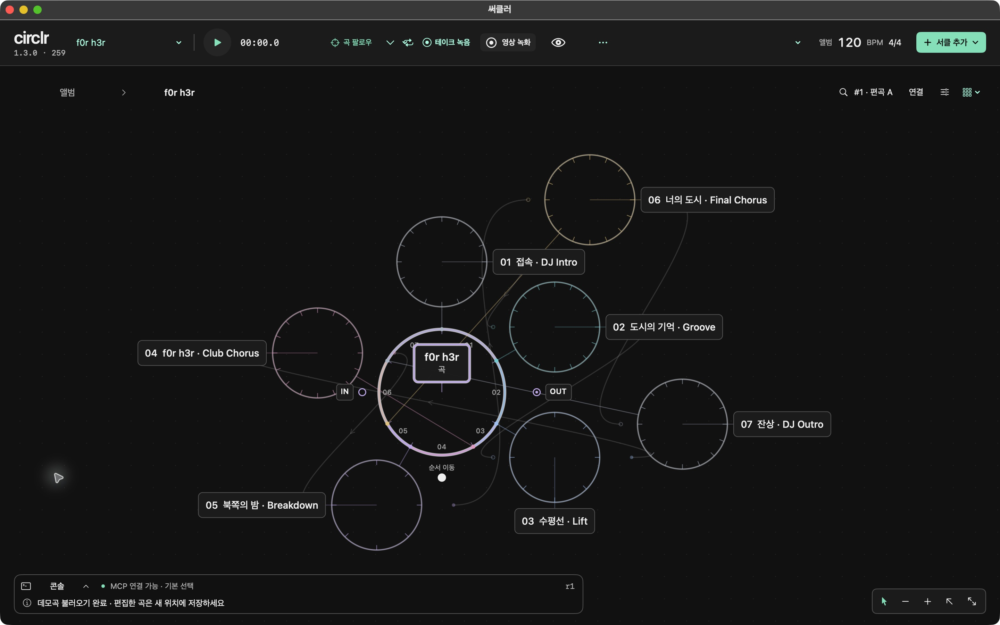
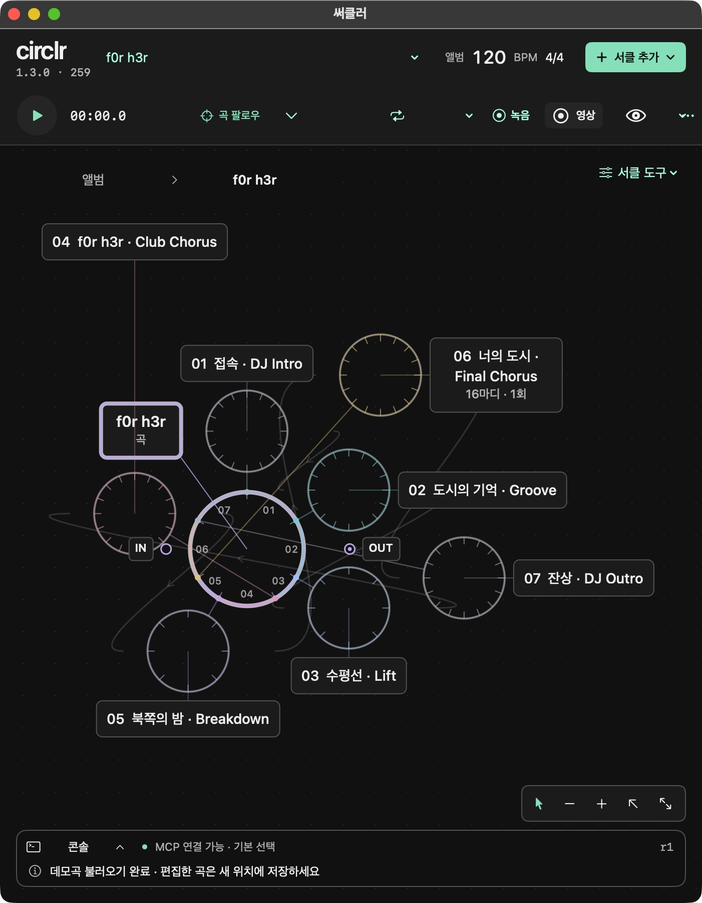

# circlr

**An orbital music workspace for songwriters and arrangers on macOS.**

English · [한국어](README.ko.md)

[Getting started](#getting-started) · [Documentation](docs/README.md) · [Roadmap](docs/releases/roadmap.md) · [Plan to 2.0](docs/releases/2.0-development-plan.md) · [Releases](https://github.com/zeztto/circlr/releases)

In circlr, a circle is a timeline. Build a song from sections, place MIDI, audio, instruments and effects on and around their orbits, and connect their inputs and outputs. Move between the whole arrangement and detailed editing on one zoomable canvas.



Screenshots show the unreleased 1.3/build259 candidate. The latest stable release remains 1.2. [Media and recovery guide](docs/1.3-media-recovery-guide.md).

*1.3.0 build259 candidate, native capture of the bundled demo. [Capture provenance](docs/images/README.md).*

> **1.2.0 · build253.** Copy MIDI phrases between circles, play from the editing cursor, hear edits at the next prepared loop boundary, and insert a reused section into the song flow. [Release notes](docs/releases/1.2.0-notes.md).

Native validation covers cross-track phrase transfer, uninterrupted loop replacement, cursor playback, section reuse, save/reopen and WAV export. Physical listening and the existing 70ms video interval failure remain outside this release’s validated scope. [Evidence and limits](qa/1.2-production-workflow.md).

In-app account chat is disabled while live-service validation is paused. The local command console and external Codex → MCP workflow remain available without account sign-in.

## What you can work with

- **Song form:** connected album, song and section timelines; reusable sections, repetitions and arrangement variations.
- **A connected canvas:** free placement, automatic layout, grids, groups, custom colors and connections around eight directions with explicit IN/OUT.
- **MIDI and audio:** orbital note editing, a drum/synth step editor, pitch bend and sustain editing, waveform trim, split and fades.
- **Sound and motion:** instrument/effect routing, automation, bounce and source restoration; playback-follow and signal visualization controls.
- **Local agents:** an MCP interface for inspecting and editing projects, generating MIDI, rendering and saving, with activity visible in the console.



*The same build253 demo stopped in a 700×900 portrait window, showing the responsive section controls and all seven sections. [Capture details](docs/images/README.md).*

These are implemented development features, not a guarantee of compatibility with every audio device or plug-in. Artist profiles and a combined text, image and video workspace are the [longer-term direction](docs/21-artist-universe.md).

## Getting started

Download **1.2.0 build253** for Apple Silicon from [GitHub Releases](https://github.com/zeztto/circlr/releases/tag/v1.2.0), or build from source.

The downloaded app is ad-hoc signed and not notarized by Apple. If macOS blocks its first launch, verify the download, then use **System Settings → Privacy & Security → Open Anyway**. [macOS installation and first launch](docs/install-macos.md#english).

If an older audio interface does not start, select the Mac built-in output in circlr and see [audio device guidance](docs/install-macos.md).

The colored **f0r h3r v6** demo is included. Choose **File → 데모곡 불러오기…** to open an editable copy.

**Source build requirements:** macOS 14+, Xcode 26+ selected as the active developer directory, and Python 3. Native validation currently covers Apple Silicon. The interface is currently in Korean; this README is available in both languages.

```sh
git clone --branch v1.2.0 https://github.com/zeztto/circlr.git
cd circlr
./scripts/build-app.sh
open 'dist/써클러.app'
```

The build on this development branch packages the app, six audio helpers, an internal trusted MCP helper and the agent kit together. Local packages use ad-hoc signing and are not notarized. Keep a separate copy of important projects when trying development builds.

Choose a synth circle, then **음색·악기 찾기** to search the built-in patches. The same patches are available through MCP `sounds`; apply the returned `synthPatch` to `instrument.synth`. Existing saved sounds are preserved until explicitly changed. [Release notes](docs/releases/0.80.0-notes.md).

## First session

1. Right-click empty canvas space to create a circle. Add sections to plan the song, then place MIDI, audio, instruments and effects on and around their orbits.
2. Zoom with the wheel over empty canvas space; double-click a circle to enter its detail. Connect ports to define signal flow.
3. Edit notes or steps, import audio/MIDI, and use the toolbar to switch to automation or sound settings.
4. Save the `.circlr` project with **⌘S**. Use **Bounce** to turn a track path into audio and **Restore original** to return to its source.

| Shortcut | Action |
|---|---|
| ⇧⌘P | Search commands and shortcuts |
| ⇧⌘V | Paste at original beat in MIDI editors; viewing mode outside MIDI editors |
| ⌘C / ⌘X / ⌘V | Copy / cut / paste selected MIDI phrase |
| ⌥⌘Return | Play the selected section from the MIDI cursor |
| ⌘J | Jump to a section, track, instrument or effect |
| Tab / ⇧Tab | Move through editor controls |
| Ctrl + ` | Show or hide the console |
| ⌘W / ⌘Q | Minimize the window / quit the app |

## Developers and agents

Start with [the documentation map](docs/README.md). Contributors should read [CONTRIBUTING.md](CONTRIBUTING.md); coding agents should also read [AGENTS.md](AGENTS.md). For music work, see [MCP setup](mcp/README.md) and the [studio agent kit](docs/24-music-agent-kit.md).

The Swift package separates the project model (`CirclrCore`), audio processing (`CirclrAudio`, `CirclrRealtime`) and macOS interface (`CirclrApp`). GUI and MCP edits use the same document model. See [architecture](docs/15-hierarchy-canvas-architecture.md) and [verification](docs/releases/README.md).

## Status, releases and license

See the [1.2 release record](docs/releases/1.2.0.md) for scope and verification limits. The unreleased [1.1 account work](qa/1.1-account-chat.md) is retained in source and disabled in the packaged UI.

Each completed version will have a Git tag and a GitHub Release with Korean/English notes, a verified app package and checksums. Development build numbers and documentation edits do not create releases. [Changelog](CHANGELOG.md) · [Release procedure](docs/releases/README.md).

Code, documentation and icons use the [MIT License](LICENSE). Music has [separate demo terms](Resources/Demos/DEMO-LICENSE.md): redistribution with the app and forks is permitted, but standalone music releases are not licensed. Six percussion assets remain CC0; classical MIDI sources remain Public Domain. See [licensing scope and credits](THIRD_PARTY_NOTICES.md) and [contributing](CONTRIBUTING.md).
