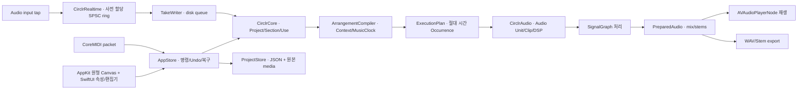
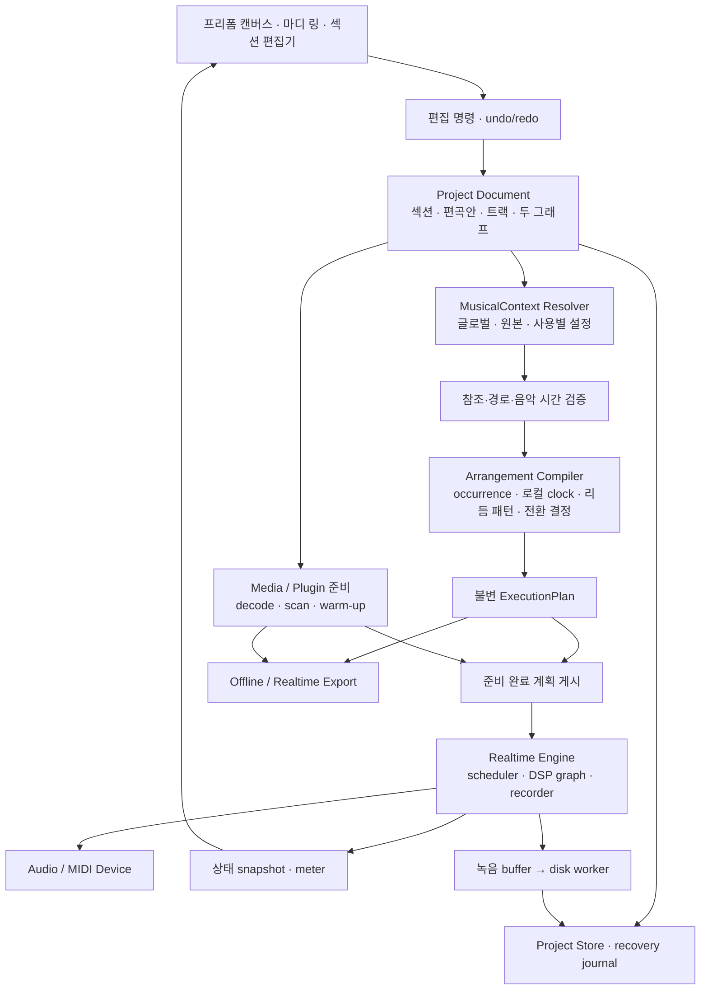

> 2026-09-07 구현 갱신: 앨범 계층과 같은 캔버스 직접 편집의 현재 소스 구조는 [계층 캔버스 아키텍처](15-hierarchy-canvas-architecture.md), 검증 범위는 [중간 QA](../qa/hierarchy-native-review.md)를 기준으로 한다.

# 기본 아키텍처

노드 연결의 향후 계약은 [8방향 포트와 다중 입출력](22-eight-direction-ports.md)이다. 논리 port ID와 케이블 끝점의 8방향 layout을 분리하고, 단일 node 출력에서 port별 입력·출력 처리로 확장한다. 기존 좌우 연결과 음원을 보존하는 migration·실행 검증을 전제로 한다.

장기 최상위 구조는 [아티스트 프로필과 창작 세계](21-artist-universe.md)다. `ArtistWorkspace`가 음악 문서와 텍스트·이미지·영상·세계관을 catalog로 연결하는 안을 제안한다. 기존 `Project/Album`은 음악 문서로 유지하고, 관계·버전·출처 관리를 audio graph와 분리한다. 아직 구현하지 않은 상위 계층이다.

계정 기반 AI 확장은 [Codex 대화형 콘솔 구현 계획](20-codex-account-console-plan.md)을 따른다. 로컬 App Server가 대화·인증을 맡고 기존 circlr MCP와 공통 편집 경로를 사용한다. 이는 향후 계획이며 오프라인 음악 엔진과 문서 모델은 AI 연결 없이 동작한다.

## 진행 중인 앨범 계층 구현

현재 목표는 [앨범 전체 작업 공간](14-album-circle-implementation.md)이다. 앨범·곡·악장·섹션·음악 서클을 확대하며 같은 캔버스에서 직접 정밀 편집한다. 아래 사각 편집 창 중심 설명은 이전 구현/설계 기록이다.

`Project.album`은 선택적인 `Album`이다. version 1 문서는 그대로 읽고 `enableAlbum()`을 명시적으로 호출한 문서부터 version 2가 된다. `Composition`은 곡 또는 악장으로, 하위 composition이나 편곡안 중 하나를 소유한다. 여러 편곡안은 한 곡의 대안이며 별개의 곡으로 취급하지 않는다. 포함·재생 순서와 layout 좌표는 독립적이다.

`compositionContext(for:)`는 앨범 글로벌부터 곡·악장을 따라 필드별 설정을 해석한다. 섹션 원본/사용의 상속도 이어지며 `global`은 중간 부모의 override를 건너뛴다. `AlbumCompiler`는 각 composition의 선택된 편곡안과 반복을 절대 시간에 배치한다. 현재 추가한 것은 저장·계획 core이며 이를 실행하는 앨범 renderer와 native 중첩 화면은 미완료다. [core 검증](../qa/album-core-review.md).

## 2026-09-07 목표 구조: 섹션 내부 서클 그래프

최신 제품 모델은 **섹션 그룹이 오디오·MIDI·악기·이펙터 서클과 typed 연결을 소유하는 구조**다. 상세 계약은 [중첩 서클 모델](13-nested-circle-model.md)에 있다. 아래 0.7.0/0.4.0 절은 현재 코드의 구현 기록이며 이 목표 구조가 구현됐다는 뜻이 아니다.

- 포함 관계, 섹션 간 진행, 내부 MIDI/audio routing을 분리하고 하나의 캔버스에서 함께 표현한다.
- `SectionGraph`와 부모 기준 layout, 자식 node별 설정·시간·사용별 override가 필요하다. `CanvasGroup`은 기존 정리용 상태로 유지하며 음악 그룹으로 자동 변환하지 않는다.
- 송폼 compiler의 occurrence마다 내부 graph를 처리 계획으로 변환한다. UI 노드와 실제 processor instance의 identity·공유 범위는 구분한다.
- 정밀 편집 창은 섹션 사용 ID와 자식 node ID를 함께 식별한다. 그룹 확대는 같은 캔버스 탐색이며 piano roll을 원 안에 넣는 동작이 아니다.
- 기존 `Lane`/`SectionUse.effects`/글로벌 `SignalGraph`의 저장·소리·변형을 보존하는 schema migration과 실행 검증이 선행되어야 한다. 특히 per-track effect를 합산 뒤의 effect로 옮기면 소리가 달라질 수 있다.

## 0.7.0 캔버스와 통합 편집 창 구현

RootView는 상단 제어와 SongCanvas 하나를 가진다. CircleCanvas의 view-local CanvasCamera가 휠/핀치 zoom과 pan, 버튼 줌의 180ms 보간을 처리한다. 편집 창을 열어도 서클과 카메라는 변하지 않는다. Theme.swift의 중성 dark palette를 AppKit/SwiftUI에서 공유한다.

EditorWindowBridge는 CanvasFocus를 관찰해 NSWindow 하나를 필요할 때 생성·재사용한다. CircleWorkspace는 이 사각 창의 NSHostingView로 들어간다. 서클 선택 시 창의 대상도 바뀌며 note/track별 PianoRoll identity를 새로 부여해 이전 drag preview를 버린다. 명시적 열기 요청(editorActivation)만 창을 앞으로 가져오므로 캔버스 드래그 도중 focus를 빼앗지 않는다. 닫기/프로젝트 교체/대상 삭제는 편집 창을 닫는다. 창과 캔버스는 하나의 AppStore, Project, undo/recovery를 공유하며 별도 사본을 만들지 않는다. 트랙·리듬·글로벌·전환·plugin 설정도 이 창을 사용한다.

UnifiedSectionView는 설정·연주·효과를 동일 ScrollView에 배치하며 EditorTab 상태가 없다. SectionEditor의 PianoRollView와 AudioLaneView는 공통 48pt/4분음표 박, 왼쪽 여백 60pt, 하나의 가로 스크롤을 사용한다. 오디오 길이는 MusicClock과 renderer의 tempo-follow 규칙으로 박 좌표에 투영한다. 선택 트랙과 clip은 AppStore에 두고 트랙/서클 전환 때 선택·preview를 초기화한다.

SectionRings는 총 재생 횟수 1…256에 대해 정확히 같은 수의 반지름을 반환한다. 외곽 확장은 최대 56pt로 제한한다. Canvas는 동일 geometry로 draw·hit·포트·그룹·fit을 계산하고, 화면상 촘촘한 링은 대비를 낮추어 표시한다.

0.5.0의 원 내부 확대 편집은 [0.6.0 결정](11-dark-canvas-editors.md)으로 대체됐다.

TransportMeter는 AppStore의 음악 상태와 분리되며, 정지 상태에서는 같은 값을 publish하지 않는다. 음악 context/plan은 project ID·music revision·편곡 ID로 캐시한다. 드래그 preview는 모델 밖에서 연속 이동하고 mouseUp 시 선택 전체의 translation을 한 번 snap한다. 카메라의 최종 상태만 layout/recovery에 저장한다.

Playback은 창을 만들 때 출력 장치를 획득하지 않는다. 실제 재생의 출력 연결과 미리듣기 장치 연결은 main thread 밖에서 수행하며, 정지/곡 변경 뒤 이전 요청의 완료를 무효화한다. 장치 또는 plugin의 막힌 시스템 호출 자체를 강제로 끊는 별도 process 격리는 제공하지 않는다.


## 0.4.0에서 채택한 구현

후속 제작 요청에 따라 첫 프로토타입은 Swift + AppKit/SwiftUI + AVAudioEngine + CoreMIDI를 채택했다. 아래의 장기 architecture 및 JUCE/Tracktion 후보 검토 기록은 남기되, 현재 기술 선택과 구분한다.



- `Sources/CirclrCore`: Codable 편집 모델, field별 상속, meter/tempo 시간 변환, 명시적 분기·반복·전환 계획, 저장 transaction.
- `Sources/CirclrAudio`: 실제 note와 clip의 offline render, native/AU effect, signal routing, playback, export, 녹음 writer와 MIDI 입력.
- `Sources/CirclrRealtime`: 고정 크기 C11 atomic SPSC ring. Audio tap은 미리 할당한 공간에 복사하며 디스크 쓰기는 consumer queue에서 수행한다. overrun은 오류로 보고한다.
- `Sources/CirclrApp`: MainActor 편집 상태, revision별 준비 audio, AppKit canvas/piano roll, SwiftUI inspector, native 파일 dialog.

음악 편집은 새 revision을 만든다. renderer에는 snapshot을 전달하고 generation이 맞는 결과만 게시한다. 재생 중 변경은 다음 재생에 적용한다. 공간 편집은 음악 revision을 올리지 않는다. 취소는 render task에 전달하며 이미 진행 중인 외부 plugin 내부 호출을 강제로 중단한다는 보장은 없다.

Project package는 version 1 `manifest.json`과 `media/` 원본으로 구성된다. staging에 완성한 후 기존 곡을 backup으로 이동하고 교체하며 실패 시 복원을 시도한다. 읽기에서는 외부 absolute path·경로 이탈·중복 주요 ID·잘못된 음악/좌표 값을 거부한다. 새로 import한 파일은 저장 전에는 절대 경로를 가질 수 있다. 모든 take를 유지하고 하나를 활성 lane에 복사해 사용한다.

현재 engine은 준비된 실제 audio를 재생한다. 아래 장기 문서의 callback 내 live graph 교체, 완전한 plugin 격리, PDC, shared processor lifecycle, 장시간 streaming, sample-accurate 외부 입력 보정은 구현 완료 범위가 아니다. 잔향은 현재 2초 고정이며 nonlinear bus를 지난 source별 stem 합은 전체 mix와 다를 수 있다.

## 장기 설계와 기술 검토 기록

버전: 0.3 · 소유 역할: architecture / development-lead · 상태: Proposed

## 구조의 핵심

**사용자가 편집하는 곡의 구조와 audio callback이 실행하는 처리 계획을 분리한다.** SectionDefinition·SectionUse·Arrangement는 음악 도메인 모델이며, framework의 timeline 또는 UI node 객체가 프로젝트의 원본 데이터가 되지 않도록 한다.

제품명은 써클러(circlr)이며 첫 대상 플랫폼은 macOS 데스크톱 앱으로 확정했다. standalone DAW 구조를 기준으로 설계한다. 계정, cloud, 서버는 핵심 편곡·녹음·재생 경로에 필요하지 않다.



동일한 프리폼 화면에서 SongGraph와 SignalGraph를 표시할 수 있지만 모델·port type·검증은 분리한다. 원형 노드의 RingModel은 ResolvedMusicalContext와 로컬 길이로부터 파생한다. CanvasGroup과 grid snap은 표시/배치 상태다. [캔버스와 음악 설정 계약](07-canvas-and-musical-context.md)을 함께 따른다.

여기서 Compiler는 곡 구조를 실행 계획으로 변환하는 책임을 뜻하며 별도 언어나 code generation을 요구하지 않는다.

## macOS 기준 설계 범위

- 첫 실행·녹음·plugin hosting·저장·export 검증은 macOS에서 수행한다.
- 음악 domain과 재생 계획은 OS 기능과 분리하고, 장치 입출력·파일 접근·창과 plugin UI의 macOS 연동은 adapter 경계에 둔다.
- macOS 앱이라는 결정이 Swift/SwiftUI나 C++/JUCE 채택을 확정하지는 않는다. 기존 기술 후보를 Mac에서의 요구 충족 여부로 비교한다.
- 최소 지원 macOS 버전, Apple Silicon/Intel 지원 범위, 배포 방식과 필수 plugin 포맷은 후속 기술 결정이다.
- 다른 OS 지원은 현재 첫 제품 범위에 포함하지 않는다. 향후 확장 가능성을 위해 domain 모델의 OS 의존을 줄인다.

## 모듈 경계와 계약

아래 경로는 **향후 코드 소유권의 제안**이며 이번 작업에서는 생성하지 않는다.

| 후보 경로 | 책임 | 입력 → 출력 | 금지할 결합 |
|---|---|---|---|
| `src/domain/` | Project와 음악 객체, 편집 명령, revision | Command → DocumentRevision | UI 좌표·audio device 의존 |
| `src/domain/context/` | 글로벌·원본·사용별 음악 설정 해석, pattern 참조 | MusicalContext 정책 → ResolvedMusicalContext | 화면 그룹에서 tempo/scale 추론 |
| `src/arrangement/` | graph 검증, 로컬 clock·pattern 전개, occurrence와 전환 | DocumentRevision + ArrangementID → Plan 또는 Diagnostic | callback에서 가변 graph 탐색 |
| `src/audio/` | transport, event scheduling, DSP, latency 보상 | PreparedPlan + control commands → audio/MIDI | 파일 I/O·UI lock |
| `src/media/` | 파일 참조, streaming, decode, waveform, stretch cache | asset request → prepared buffer/cache | callback에서 decode |
| `src/plugins/` | scan, device state, format adapter, crash 격리 경계 | plugin descriptor + state → prepared processor | plugin 이름을 영속 ID로 사용 |
| `src/recording/` | input buffer, take writer, occurrence mapping | sample clock input → take와 clip 참조 | take 덮어쓰기 |
| `src/persistence/` | project/package, atomic 저장, journal, migration | revision + asset/state refs → durable snapshot | runtime pointer 저장 |
| `src/export/` | revision 고정, render, stem·tail·metadata | PreparedPlan + ExportSpec → 파일과 보고 | 현재 UI 상태를 render 중 다시 읽기 |
| `src/ui/` | 프리폼 canvas·grid/group·ring·상세 editor·mix·흐름 띠 | document/runtime snapshot → 표시·Command | 음악 모델을 화면 도형에 내장 |

Project에는 저장용 document revision 외에 musicRevision과 layoutRevision을 구분하는 안을 제안한다. 정렬·그룹 이동·zoom은 layoutRevision만 바꾸고 유효한 음악 계획을 재사용한다. export는 요청 시점 document snapshot과 musicRevision을 함께 기록한다. 음악 설정 변경은 상속 의존성을 따라 영향받는 occurrence와 리듬 계획을 다시 준비한다.

Diagnostic에는 관련 객체 ID, 오류 유형, 음악 위치, 해결 동작을 담는다. `INVALID_GRAPH` 하나로 모든 오류를 뭉치지 않는다. UI는 동일한 domain command를 drag와 키보드에서 호출한다.

유한 반복도 매우 큰 계획을 만들 수 있다. 계획의 occurrence 수·event 수·메모리 예산을 사전 계산하여 감당할 수 없는 계획을 callback에 보내지 않는다. 실제 한도는 기준 장치와 workload를 선정한 기술 검토에서 결정하고 초과 위치를 사용자에게 알린다.

## 편집에서 재생까지

1. UI가 `MoveSectionUse`, `SetRepeatCount`, `OverrideClip`, `AttachTransition` 같은 의미 단위 명령을 낸다. 명령명은 제안이다.
2. document가 명령을 적용하고 새 revision과 undo 정보를 만든다.
3. layout 전용 명령은 화면 상태만 저장한다. 음악 변경은 context resolver가 항목별 상속과 pattern 참조를 해석하고, 검증기가 분기·반복·시간 map·충돌·transition 범위를 확인한다.
4. compiler가 선택한 Arrangement를 occurrence로 펼치고 local event와 rhythm pattern을 해당 clock map을 통해 공통 sample 시간에 배치한다. 대표 host transport map은 별도로 만든다.
5. media/plugin worker가 필요한 자원, voice, routing, latency와 pre-roll을 준비한다.
6. engine은 현재 계획과 이어 붙일 수 있는 안전한 경계에서 준비 완료 계획을 교체한다. UI에 실제 적용 revision을 되돌린다.
7. 이전 계획과 buffer는 audio thread가 더 이상 참조하지 않는 것을 확인한 뒤 non-RT worker에서 해제한다.

공유 pointer의 마지막 참조 해제가 callback 안에서 대량 destructor를 실행하지 않게 수명 회수 방식까지 설계한다. `atomic swap`이라는 표현만으로 realtime 안전을 충족했다고 보지 않는다.

## realtime thread 규칙

callback의 역할은 준비된 event와 buffer를 정해진 sample 위치에서 처리하는 것이다. 메모리 할당/해제, disk/network I/O, blocking lock, plugin scan/state 로딩을 넣지 않는다. 이러한 callback 제약은 [PortAudio의 공식 지침](https://portaudio.com/docs/v19-doxydocs/writing_a_callback.html)과도 일치한다. 실제 engine library 선정과 별개로 적용할 설계 원칙이다.

- UI/control 명령은 capacity가 정해진 queue로 전달하고 overflow 정책을 명시한다. replace 가능한 parameter 값은 최신 값으로 합칠 수 있지만 녹음 event를 조용히 버리면 안 된다.
- meter는 낮은 빈도의 snapshot으로 UI에 전송하며 UI 지연이 소리 처리에 역류하지 않는다.
- 경계가 audio block 중간에 있으면 sample offset에서 처리한다. callback 횟수로 섹션 시간을 계산하지 않는다.
- graph·media 준비가 끝나지 않은 자원은 활성 계획에 진입시키지 않는다.
- 디스크 streaming buffer 부족, xruns, 녹음 drop은 계측하고 사용자에게 정확한 구간을 알린다.
- 장치 sample rate나 block 크기 변경은 멈춤/재준비 경로로 처리하고 UI 상태와 녹음 결과를 일치시킨다.

48 kHz에서 128-frame block은 약 2.67 ms다. 이는 한 block의 시간이며 input-to-output latency 보장이 아니다. 실제 latency에는 device, driver, buffering, plugin lookahead 등이 포함된다.

## signal graph와 plugin

SignalGraph의 포트는 audio/MIDI/control 종류와 channel layout을 갖는다. 실제 리듬 패턴은 RhythmSource를 통해 지정된 Track/Instrument로 들어가고 BeatGrid만으로 소리를 만들지 않는다. 순서 graph와 연결 타입을 공유하지 않는다. 첫 범위는 instrument, 직렬 insert, 병렬 send/return, bus, master, sidechain이다. audio feedback 연결은 delay와 latency 보상 규칙까지 필요하므로 보류한다.

Track은 안정적인 device instance를 유지한다. SectionUse는 공통 graph의 특정 parameter와 필요한 분기 경로를 활성화한다. section마다 다른 processor가 꼭 필요하면 명시적으로 device instance를 만든다. 섹션별 preset 변경을 단순하고 비용 없는 scalar 변경처럼 처리하지 않는다.

이종 tempo가 겹칠 때 각 occurrence는 별도의 음악 clock을 갖지만 공유 plugin의 host tempo context는 하나다. 도착 섹션 시작 시 대표 transport를 넘기는 안을 제안하며, 출발 tempo를 계속 요구하는 processor는 분리 instance 또는 준비된 render가 필요하다. 이 조건이 충족되지 않으면 이유와 가능한 전환 방식을 표시한다.

plugin scan은 별도 worker process를 기본안으로 한다. runtime도 제3자 plugin 격리 경계를 설계하되 in-process 대비 process 격리의 latency·CPU·GUI·state 복구 비용을 기술 검토에서 측정한다. 격리 구현 전에는 plugin crash가 host 전체를 멈추지 않는다고 주장할 수 없다.

plugin 누락/실패 시 ID와 state blob은 보존한다. 명시적 bypass를 선택하기 전 조용히 다른 소리로 export하지 않는다. device chain 지연이 바뀌면 compensation 계획도 다시 준비한다. AU/VST3/CLAP 등 지원 포맷과 필수 plugin은 [Q05](05-decisions-and-validation.md)에서 결정한다.

## 저장과 복구

native 프로젝트는 manifest와 asset을 포함하는 package 형식을 제안한다. 예시 확장자 `.circlr`도 미확정이다.

```text
project.circlr/              형식 설명; 이번에 만드는 디렉터리가 아님
  manifest.json             schemaVersion, revision, object references
  media/                    수집한 원본 녹음과 import asset
  plugin-state/             ID별 저장된 상태
  recovery/                 snapshot 이후 편집/녹음 복구 정보
  cache/                    재생성 가능한 waveform·decode·render cache
```

- 미디어를 프로젝트 안에 수집하는 것을 기본 제안으로 하고 외부 파일 참조도 명시적으로 지원한다.
- 원본 bytes는 변경하지 않으며 clip은 범위·offset·fade·warp 지시를 참조한다.
- 저장은 새 snapshot을 쓰고 검증한 뒤 atomic commit한다. 연결된 asset이 확보되기 전에 완료로 표시하지 않는다.
- 복구 journal과 take는 crash 이후에도 추적 가능해야 한다. 녹음 파일 finalize가 실패해도 복구 가능한 데이터를 보존한다.
- plugin state는 안정된 checkpoint로 저장하고 document revision과 대응시킨다. 재생 중 state 수집의 thread 제약은 포맷별로 검토한다.
- schema migration은 원본 backup을 보존하고, 더 최신 schema를 읽지 못하면 덮어쓰기를 금지한다.
- cache 삭제와 원본 삭제를 별개로 처리한다. clip 삭제가 파일 삭제가 되지 않는다.

## 기술 후보와 선택 조건

현재는 언어/framework 확정 없이 domain과 engine 계약을 먼저 세운다. 다음의 우선순위는 조사에 기반한 제안이며 benchmark 결과가 아니다.

| 후보 | 검토할 장점 | 확인해야 할 비용 | 제안 |
|---|---|---|---|
| C++ + JUCE + 자체 arrangement 계층 | audio application과 plugin 개발에 필요한 framework 기반 | 녹음·streaming·scheduling·복구·고급 UI를 직접 통합 | 우선 기술 검토 후보 |
| C++ + JUCE + Tracktion Engine adapter | sequence 기반 engine과 DAW 기능 재사용 가능 | 자체 SongGraph와 engine 시간 모델의 호환성 | 같은 시나리오로 비교 후보 |
| native audio engine + WebView UI | node interaction과 UI 도구 생태계 활용 가능 | UI/audio IPC, plugin window, focus, accessibility | UI 요구 확인 후 검토 |
| Rust 중심 자체 engine | ownership와 타입 모델을 설계에 적용 가능 | plugin hosting·cross-platform audio 통합 부담 | 팀 역량과 hosting 요구 확인 후 검토 |

JUCE의 application/plugin 지원 범위는 [공식 소개](https://juce.com/)와 [AudioProcessorGraph 문서](https://docs.juce.com/master/classjuce_1_1AudioProcessorGraph.html)를 참고했다. 이 API가 circlr의 송폼 의미, 저장, 녹음, 모든 latency 처리를 자동 제공한다는 뜻은 아니다.

Tracktion Engine은 sequence 기반 audio application을 위한 high-level model을 제공한다고 설명한다. 이를 재사용하더라도 circlr의 SectionUse·Transition·Arrangement는 독립 모델로 유지하고 adapter를 통해 연결하는 안을 검토한다. API 적합성·라이선스 조건·도입 버전은 실제 채택 전에 확인할 항목이며 이번에 선택하지 않았다. [공식 저장소](https://github.com/Tracktion/tracktion_engine)

브라우저 단독 구현이 모든 사용자의 녹음·plugin 요구를 충족한다고 가정하지 않는다. 필요한 장치와 plugin 목록이 없는 상태에서 포맷 지원이나 cross-platform 품질을 약속하지 않는다.

## 주요 설계 결정 기록

| ADR | 상태 | 제안 | 이유와 trade-off |
|---|---|---|---|
| ADR-001 | Proposed | 송폼·신호 논리 graph 분리, 같은 프리폼 canvas에서 유형별 표시 | 연결 의미 보존; port와 링의 시각 충돌 검토 필요 |
| ADR-002 | Proposed | 원본·사용·occurrence 분리 | 재사용과 국소 변형 가능; 편집 범위 학습 필요 |
| ADR-003 | Proposed | 순환 없는 흐름 + 명시적 반복 | 길이와 export 결정 가능; 임의 순환 표현 제약 |
| ADR-004 | Proposed | 곡 공통 트랙·device 유지 | 음색 정체성과 tail 보존; 사용별 isolation은 추가 자원 |
| ADR-005 | Proposed | domain revision → 불변 계획 | RT와 undo 분리; 준비·적용 시점 상태 필요 |
| ADR-006 | Proposed | occurrence별 음악 clock과 공통 sample clock, 대표 host transport 분리 | 서클별 tempo와 이종 overlap; 시간 변환과 plugin context 검증 필요 |
| ADR-007 | Proposed | local-first native 프로젝트 | 오프라인 작업·asset 보존; package/migration 구현 부담 |
| ADR-008 | Proposed | runtime·offline에 동일 계획 | 편곡 결과 일관성; 외부 plugin의 소리 결정성은 별개 |
| ADR-009 | Proposed | 프리폼 원형 node와 마디 링 + 상세 editor | 사용자가 확정한 기본 화면을 구체화; 내부 editor 형태는 미결 |
| ADR-010 | Proposed | 항목별 MusicalContext 상속·독립 설정 | 글로벌 수정과 서클의 개별 의도를 동시에 보존 |
| ADR-011 | Proposed | CanvasGroup과 음악 반복/bus의 의미 분리 | 정렬·정리가 소리에 영향 주지 않음 |
| ADR-012 | Proposed | BeatGrid와 실제 RhythmPattern 분리 | 리듬 기준 변경과 연주 데이터 변경을 구분 |

## 다음 기술 검토의 종료 조건

현재 승인 범위는 여기까지의 문서 설계다. 아래 항목은 후속 개발 요청이 있을 때만 실행할 검증 과제다.

- 동일한 68마디 편곡을 원본 공유·국소 변형·전환을 유지한 채 후보 engine에 표현할 수 있는가.
- 경계가 block 중간에 있을 때 event 시간이 정확한가. insert/overlap/tempo 변경 시 누적 오차가 없는가.
- 녹음된 take를 보존하면서 섹션 재배치와 반복 회차 복구가 가능한가.
- 필요한 가상악기를 사용할 수 있고 section 진입 때 로딩으로 끊기지 않는가.
- 재생 중 수정과 저장/export가 같은 revision 계약을 유지하는가.

이 결과가 없으므로 기술 후보의 성능·음질·안정성 우열은 미확인이다.
