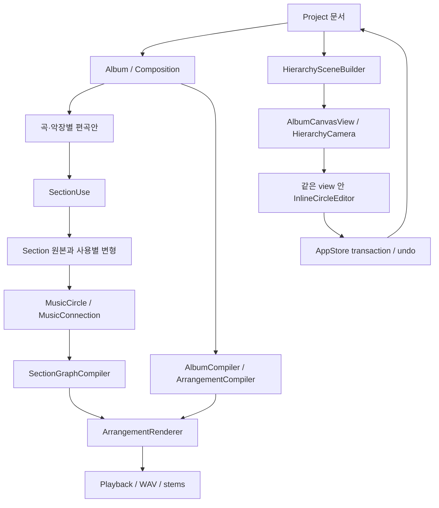

# 같은 캔버스에서 확대해 편집하는 서클 아키텍처

2026-09-07 · 0.8.0 구현 중. 기존 정밀 편집 창 방향은 사용자 확인에 따라 같은 캔버스 직접 편집으로 대체한다. 아래는 현재 소스와 실행 검증에 맞춘 구조다.

## 네 종류의 관계

후속 연결 모델은 [8방향 포트와 다중 입출력](22-eight-direction-ports.md)으로 확장한다. 관계 종류를 유지하면서 각 연결 끝점에 port ID와 화면 방향을 부여하며, 위치 변경은 음악 시간과 신호를 바꾸지 않는다. 아직 구현 전인 계약이다.

- **포함**: Album → Composition(song/movement) → SectionUse → MusicCircle. 그룹의 이동·확대와 음악 시간은 분리한다.
- **진행**: 앨범과 악장은 정렬된 child ID 배열, 섹션은 FlowEdge와 선택 경로를 사용한다. 공간 좌표만 바꾸어서는 연주 순서가 바뀌지 않는다.
- **신호**: MusicConnection은 MIDI 또는 audio를 전달한다. instrument는 MIDI→audio, effect/mix는 audio→audio다. compressor sidechain은 별도 연결 속성이다. 무한 순환 대신 명시적 반복을 사용한다.
- **참조/변형**: Section은 원본, SectionUse는 사용 위치와 변형이다. MIDI·audio 서클은 Lane 및 clip ID를 참조하고 노트·오디오를 중복 저장하지 않는다.

## 저장과 수정

`Project.album`은 version 2에서 앨범 구조를 추가한다. Composition은 하위 곡·악장 또는 편곡안 중 하나를 소유한다. 모든 편곡안과 하위 Composition의 부모는 하나다. cycle, orphan, 중복 ID, 잘못된 설정과 제한 초과는 검증 단계에서 거부한다.

`Section.graph`는 원본 music graph, `SectionUse.graphEdits`는 stable ID별 노드/연결 추가·삭제·수정이다. 사용별 MIDI 노트와 clip은 기존 laneOverrides/addedLanes를 쓴다. `ProjectEditing.setLane`은 새로운 clip/lane만 새 source로 만들며, 제거된 clip의 노드와 연결을 정리한다. 일반 노트 편집으로 사용자가 끊은 연결이나 삭제한 음악 노드를 복원하지 않는다.

수정은 후보 Project에서 실행하고 성공한 문서만 AppStore에 반영한다. 원본 graph 수정은 영향을 받는 모든 사용의 effective graph를 검증한 뒤 커밋한다. 렌더링은 불변 snapshot과 revision을 사용하며, 재생 중 편집은 다음 준비 시 반영한다.

기존 package를 열면 ID·asset·원본·변형·편곡안과 효과를 보존하며 메모리에서 확장한다. 실제 형식이 변경되면 projectURL을 비워 새 위치 저장을 요구하므로 기존 version 1 package를 자동 덮어쓰지 않는다.

## 음악 시간

각 단계에서 tempo/meter/scale/BeatGrid/RhythmPattern의 출처를 독립적으로 선택한다. inherit는 부모, global은 앨범, local은 명시 값이다. scale 변경은 MIDI pitch를 자동 변환하지 않는다.

`MusicClock`은 섹션 마디·변박·tempo map을 seconds로 바꾼다. MIDI 서클의 시작은 부모 beat, 내부 노트와 명시적 반복 길이는 해당 서클의 음악 clock을 따른다. audio는 clip 원본 구간과 source BPM을 유지하며, 개별 tempo·길이·반복 경계로 schedule/trim한다. 상속한 가변 tempo map의 연속 audio warp는 아직 지원하지 않으며 명시적으로 거부한다.

`AlbumCompiler`는 곡·악장 반복과 섹션 실행 계획을 하나의 절대 시간에 배치한다. 음원 renderer, playback과 export는 이 공통 실행 계획을 사용한다. 기존 per-track use.effects는 migration에서 track별 mix 뒤의 실제 effect 서클로 변환하여 비선형 처리 순서를 유지한다.

## 화면과 카메라

`HierarchySceneBuilder`는 문서에서 address·부모·중심·반지름·음악 context를 계산한다. 주소는 album/composition/section/music/group/sound/signal을 식별한다. 원의 외곽은 자식을 포함하도록 커지고, 마디와 반복은 음악 metadata에서 표시한다. layout 좌표는 부모 단위이며 재생 시간에 영향을 주지 않는다.

`HierarchyCamera`는 world/screen 좌표, 포인터 고정 zoom, 선택 서클 맞춤, 로그 배율 보간을 소유한다. 드래그 preview는 NSView 내부에서 처리하고 놓을 때 한 번 문서를 갱신한다. scene은 문서 revision별로 캐시하며, node와 child 조회는 인덱스를 사용한다. `Project.hierarchyView`에 카메라·뷰 크기·선택 주소·설정 모드를 저장한다. 다른 창 크기에서는 중심을 보정하고 손상된 카메라는 전체 보기로 돌아간다.

`AlbumCanvasView`가 하나의 캔버스를 그린다. 작은 배율에서는 현재 계층의 이름만 드러내고, 음악 서클이 충분히 커지면 같은 view hierarchy 안에 `NSHostingView<InlineCircleEditor>`를 배치한다. MIDI는 실제 PianoRollView, 오디오는 AVAudioFile sample에서 계산한 파형과 clip 구간, effect는 실제 graph payload를 편집한다. 별도 NSWindow나 좌우·하단 고정 pane은 없다. Audio Unit 제공 view controller도 이 영역에 붙인다.

일반 휠은 편집기 위에서도 canvas zoom이다. Shift 휠은 정밀 편집 영역 스크롤로 남긴다. 상위 경로와 Esc로 포함 관계를 따라 복귀한다. 메인 NSWindow의 닫기 최소화 delegate는 유지한다.

## 통합과 현재 경계

`Layout.groups`는 음악 소유권과 독립적인 배치 그룹이다. 그룹은 자식 scale을 1로 유지해 묶는 순간 음악 서클의 위치·반지름을 보존한다. 접으면 내부만 숨기고 외부 wire를 그룹 외곽으로 투영한다. 원래 signal/flow 데이터는 바뀌지 않는다.

`Project.signal`은 `.sound` 컨테이너와 `.signal(id)` 서클로 직접 표현한다. section renderer의 트랙별 출력을 기존 전역 signal pipeline에 전달한다. 화면과 음원의 graph를 따로 만들지 않는다.

녹음은 시작 시 `targetLaneID`와 `arrangementID`를 보관한다. Take 적용은 현재 선택 대신 저장된 대상을 찾고, 대상이 삭제됐으면 거부한다. MIDI Take는 같은 Lane의 오디오를 보존한다. 개별 source clock은 부분 마디 길이와 부모에서 상속한 tempo map을 사용한다. Audio Unit view와 state callback은 요청 시의 hierarchy address·descriptor와 일치할 때만 적용한다.

모든 hierarchy 기능은 로컬 macOS 앱에 통합했다. 오디오는 재생 전에 PCM을 준비한다. 연속 실시간 그래프 엔진, plugin crash 격리/PDC와 모든 외부 장치/플러그인 조합은 현재 검증 범위에 포함하지 않는다. 최종 증거는 [native 검증](../qa/hierarchy-native-review.md)에 있다.
