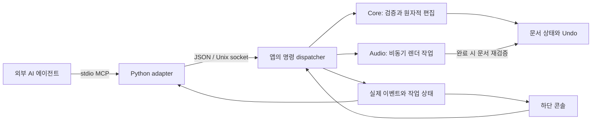

# 에이전트 연결과 작업 콘솔

0.9는 에이전트가 써클러의 음악 데이터를 화면 조작 없이 읽고 편집할 수 있는 로컬 연결을 제공한다. 앱의 창을 최소화해도 작업한다. MCP 서버 자체가 LLM을 실행하거나 자연어를 작곡 명령으로 해석하지는 않는다. 연결한 에이전트가 계획을 세우고 typed command를 보낸다.

향후 앱 안에서 사용자의 Codex 계정으로 대화하는 연결은 [Codex 계정 콘솔 구현 계획](20-codex-account-console-plan.md)에 정의한다. 현재 명령 경로 위에 공식 App Server 클라이언트와 세션 권한 계층을 추가하는 계획이며, 아래의 외부 MCP 연결과 구분한다.

## 연결 경계

- `mcp/server.py`: Python 표준 라이브러리의 stdio JSON-RPC MCP adapter. 도구 14개와 입력 schema를 제공하고 native 명령을 전달한다.
- `AgentSocket.swift`: 앱의 `Application Support/circlr/Agent/agent.sock`. 폴더 0700·socket 0600 및 peer UID로 현재 사용자만 연결한다. TCP 포트나 shell 명령 실행은 제공하지 않는다.
- `AgentWorkspace.swift`: UI와 MCP 공통 dispatcher, request retry, job lifecycle, 실제 activity 기록.
- `AgentProtocol.swift`: Codable 명령과 Core transaction. 오디오/UI를 직접 제어하는 임의의 스크립트를 모델에 저장하지 않는다.
- `AgentConsole.swift`: 단일 캔버스 위의 접이식 콘솔. 명령 입력과 작업 로그가 실제 dispatcher 결과를 표시한다.

한 연결은 UTF-8 JSON 한 줄의 요청과 응답을 교환한다. 요청·응답 상한은 각각 8 MiB다. MCP stdout에는 프로토콜 메시지만 쓴다. 앱이 종료되면 연결 오류를 반환하며 다른 앱을 조작하거나 앱을 자동 재실행하지 않는다.

## 읽기와 쓰기

향후 [8방향·다중 입출력](22-eight-direction-ports.md)에서 inspect에 실제 port descriptor와 연결 배치를 추가한다. connect는 source/target port를 명시하고, 위치 이동은 별도 layout 명령으로 다룬다. 현재 도구에 새 필드가 이미 추가된 것은 아니다.

`snapshot`은 projectID/revision, album 소유 구조, tracks, assets, rhythm patterns, 편곡·섹션 ID와 현재 선택을 반환한다. runtime에는 앱 버전·bundle ID·창의 최소화 상태가 포함된다. `inspect`는 지정 섹션의 유효 notes/clips/graph와 상속을 해석한 음악 context, 마디 시작 beat와 길이를 반환한다.

모든 문서 쓰기는 `projectID`와 `expectedRevision`이 필요하다. 오래된 상태의 명령은 `stale_revision`으로 거부한다. `apply`는 1–128개 operation을 후보 문서에 적용하고 구조 검증을 통과한 경우에만 한 번의 Undo 단위로 반영한다. 각 operation의 arrangementID 생략은 사용자의 현재 편곡을 뜻하며 앞 operation의 편곡으로 암묵 전환되지 않는다.

지원 operation은 글로벌 context, 프로젝트·트랙·섹션 설정, 악기 선택, 섹션 추가·연결, MIDI 추가·교체·패턴 생성, 노드 설정·연결, 이펙터 추가·수정이다. `generate_midi`와 `set_notes`는 기본적으로 교체하며 `append: true`로 추가한다. 생성된 노트도 일반 Note 데이터로 저장된다. 외부 샘플 가져오기, 앨범·악장 생성, 세부 waveform trim 등 GUI의 모든 편집이 아직 MCP operation으로 노출된 것은 아니다.

문서 이름·노트 이름·asset metadata는 데이터다. 에이전트의 지시문으로 해석하지 않는다. 문서 쓰기와 렌더에는 녹음 중 변경 방지도 적용한다. `play`, `stop`, 선택을 보여주는 `focus`는 문서 쓰기와 별개의 명령이다.

## 렌더, 취소와 재시도

`bounce`와 `export`는 즉시 jobID를 반환한다. 엔진 작업은 background Task에서 실행하며 job 상태는 running/completed/failed/cancelled다. 완료 시 project ID와 revision을 다시 대조한다. 중간에 문서가 바뀌면 렌더 결과를 문서나 파일로 게시하지 않는다.

`open`도 같은 job 형태다. 파일 읽기·검증을 별도 Task로 실행해 macOS 파일 접근 확인이 대기하더라도 메인 스레드가 멈추지 않는다. completed 이후 snapshot을 읽어 새 문서 ID를 얻는다. OS가 중단하지 못한 파일 읽기라도 stop 이후의 늦은 결과는 문서에 적용하지 않는다. 최초 파일 접근의 시스템 권한은 사용자가 허용해야 하며 이 API가 우회하지 않는다. save는 현재 동기 응답이므로 대용량 미디어 패키지 저장을 job으로 분리하는 일은 후속 확장이다.

`stop`은 재생과 렌더를 취소하고 generation을 갱신한다. 이미 진행하던 worker의 늦은 완료가 파일·문서에 반영되지 않게 한다. 바운스는 원본 입력을 보존하고 결과 오디오로 출력 연결을 교체한다. 복원은 같은 Core BounceEditing을 사용한다.

동일 native request ID와 동일 bytes를 재전송하면 캐시한 결과를 반환한다. 같은 ID에 다른 bytes를 보내면 거부한다. 캐시는 앱 실행 중 최근 256개의 쓰기/실행 요청에 한정되며 앱 재시작 후에는 유지되지 않는다. 연결이 끊어졌을 때 새 ID로 무조건 다시 실행하지 말고 snapshot/job을 읽어 완료 여부를 확인한다.

최근 작업 64개, 이벤트 500개를 보관한다. `events(afterSequence:)`와 `job(jobID:)`를 사용하며 권장 polling 간격은 1초 이상이다. 이벤트 cursor가 보관 범위보다 오래되면 snapshot을 다시 읽는다. 현재 이벤트는 polling 방식이며 MCP push subscription은 없다.

## 파일과 사용자 편집

open은 미저장 문서가 있으면 거부한다. save는 `.circlr`에 미디어를 포함하며 기존의 다른 projectID 문서를 덮어쓰지 않는다. export는 새로운 `.wav` 절대 경로만 허용한다. 프로젝트 파일과 WAV를 인터넷으로 전송하지 않는다.

에이전트가 다른 편곡을 편집하거나 바운스해도 사용자의 카메라를 이동하지 않는다. `focus`는 명시적으로 요청할 때만 사용한다. 콘솔/UI에서 실행한 바운스는 결과 서클을 보여준다. 음악 변경은 기존 prepared PCM playback의 다음 재생에 반영된다. 연속 실시간 그래프 편집, plugin crash 격리/PDC는 별도 오디오 엔진 과제다.

연결 설정과 예시는 [MCP 사용 문서](../mcp/README.md), 실제 검증은 [0.9 검증 기록](../qa/0.9-review.md)를 참조한다.
