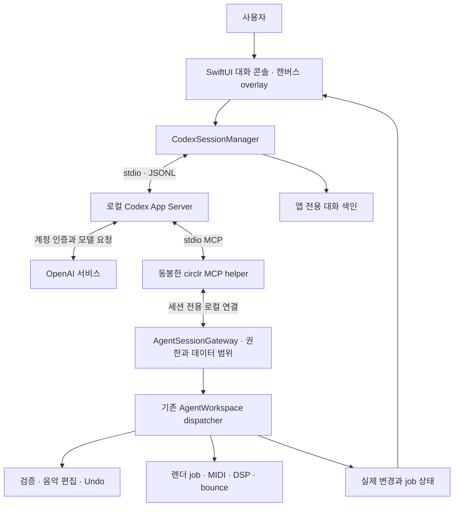

# Codex 계정 기반 대화형 콘솔 구현 계획

작성일: 2026-09-07 · 상태: 향후 구현 계획 · 기준 앱: circlr 0.10.0

> 2026-09-23 재확인: 공식 [App Server 문서](https://learn.chatgpt.com/docs/app-server)는 현재 `codex app-server` 명령을 experimental·production 미지원으로 표시한다. 공개 0.80 계정 콘솔은 [G0 판단](releases/0.80.0.md)에 따라 보류한다. 아래 설계의 API와 패키징 가정은 지원 상태가 바뀌고 실제 macOS 격리·배포 QA가 끝나기 전까지 제품 계약이 아니다.

**사용자가 자신의 ChatGPT 계정으로 Codex에 로그인하고, circlr의 접이식 콘솔에서 대화하며 곡을 편집한다.** circlr가 로컬 Codex App Server를 관리하고, Codex는 circlr MCP를 통해 기존 음악 명령을 실행한다. 로그인 과정의 공식 브라우저를 제외하면 별도의 Codex 앱·터미널을 열 필요가 없는 경험을 목표로 한다.

이 문서는 아키텍처 결정과 구현 순서다. 계정 연결·모델 호출·런타임 설치는 수행하지 않았으며 0.10.0에 자연어 대화 기능이 추가된 것은 아니다. 문서의 새 타입·파일·정책은 모두 구현 예정이다.

## 1. 공식 근거와 선택

| 확인한 사실 | circlr의 결정 | 공식 근거 |
|---|---|---|
| App Server는 자체 클라이언트의 인증·대화·승인·이벤트 연결을 위한 인터페이스다. | 네이티브 Swift 클라이언트와 로컬 자식 프로세스를 사용한다. | [App Server](https://learn.chatgpt.com/docs/app-server) |
| ChatGPT 로그인은 구독 접근, API key 로그인은 사용량 과금 경로다. | 첫 범위는 개인의 ChatGPT/Codex 계정. API 결제 방식으로 자동 전환하지 않는다. | [Authentication](https://learn.chatgpt.com/docs/auth) |
| SDK는 자동화에 사용할 수 있고, 풍부한 사용자 클라이언트에는 App Server가 안내된다. `codex mcp-server`는 deprecated다. | SDK/TUI 임베딩을 주 대화 경로로 삼지 않는다. 기존 **circlr MCP server**는 계속 사용한다. | [Codex SDK](https://learn.chatgpt.com/docs/codex-sdk) |
| Codex는 로컬 stdio MCP와 도구별 설정을 지원한다. | 원격 MCP 서버를 운영하지 않고 음악 도구만 제공한다. | [MCP](https://learn.chatgpt.com/docs/extend/mcp?surface=cli) |
| Codex CLI와 App Server 소스가 공개되어 있다. | 배포 시 선택 릴리스의 라이선스·NOTICE·의존 실행 파일을 별도로 확인한다. | [Open Source](https://learn.chatgpt.com/docs/open-source) |

선택 근거와 제품 설계는 구분한다. 위 문서가 circlr의 상용 배포 승인, 모든 계정의 이용 자격, 모든 Codex 도구의 자동 제공을 보장하지는 않는다. 현재 Codex 대화의 기억·도구·계정 세션이 circlr로 자동 이전되는 것도 아니다. circlr용 새 대화와 음악 도구를 구성한다.

App Server 문서는 실험적 기능과 WebSocket의 production 제한을 명시하며, 설치된 CLI도 명령을 experimental로 표시한다. **stdio와 비실험 API를 선택하더라도 서비스 안정성 보장이 되는 것은 아니다.** 호환 버전을 고정하고 재배포·인증·지원 상태를 확인하는 G0를 통과한 뒤 출시를 판단한다. 엔터프라이즈 대상은 공식 문서의 알려진 클라이언트 등록 안내도 확인한다. [App Server의 연결·초기화·실험 API 안내](https://learn.chatgpt.com/docs/app-server)

## 2. 현재 구현에서 이어받을 것

| 현재 파일 | 실제 역할 | 후속 변경 경계 |
|---|---|---|
| `Sources/CirclrApp/AgentConsole.swift` | 명령 입력, 실제 activity 표시, 접이식 overlay | 자연어 대화·계정·작업 상태를 같은 overlay에 추가 |
| `Sources/CirclrApp/AgentWorkspace.swift` | native dispatcher, revision 확인, batch·job·이벤트·재전송 처리 | 내부 Codex 호출의 실행 범위와 출처 확인을 앞단에 추가 |
| `Sources/CirclrApp/AgentSocket.swift` | 현재 사용자만 접근하는 Unix socket | 기존 외부 MCP 호환성을 유지하면서 내장 세션의 전용 연결을 추가 |
| `Sources/CirclrCore/AgentProtocol.swift` | typed 편집 명령, 원자적 적용 | 음악 명령의 원본 계약 유지 |
| `Sources/CirclrApp/AppStore.swift` | 문서·Undo·녹음·렌더 generation | 세션과 문서의 연결, 작업별 취소 경계 |
| `mcp/server.py` | 14개 도구를 가진 Python stdio adapter | 외부 개발용으로 유지. 배포용 Swift helper와 계약을 공유 |
| `Package.swift`, `scripts/package-app.py` | Swift target와 로컬 앱 패키징 | 런타임·helper·서명·호환성 manifest 포함 |

현재 콘솔은 shell이나 LLM이 아니다. `AppStore.stop()`은 음악 재생·녹음·렌더를 함께 중단한다. snapshot에는 경로와 asset metadata가 포함되고, 현재 socket은 로그인한 OS 사용자 범위만 확인한다. 이 상태를 그대로 인터넷 모델에 연결하면 세션별 권한과 데이터 범위가 부족하다.

기존 [에이전트 명령 계약](17-agent-interface.md)과 [궤도 타임라인](19-orbit-timeline.md)을 유지한다. AI는 UI 좌표 대신 project/arrangement/use/lane/node ID와 박·마디·스케일·음색 파라미터로 작업한다. 모델 응답 문자열로 `Project`를 직접 덮어쓰지 않는다.

## 3. 목표 구조

OpenAI와의 계정·모델 통신은 Codex 런타임이 담당한다. circlr 백엔드에 사용자 토큰을 모으지 않는다. AgentSessionGateway는 circlr가 새로 구현할 로컬 집행 계층이며 OpenAI API 이름이 아니다.

실행 정책은 다음과 같다.

- 앱 프로세스가 검증된 절대 경로의 런타임을 `Process`와 인자 배열로 실행한다. shell 문자열·PATH 탐색·사용자 시작 스크립트에 의존하지 않는다.
- 제어 채널은 stdio를 사용한다. App Server와 MCP의 서로 다른 프레이밍을 별도 codec으로 다룬다. 모델 스트림과 stderr 진단도 분리한다.
- 프로젝트당 대화 여러 개를 보관하되 첫 버전은 한 문서에 하나의 활성 AI turn만 허용한다. 임의 subagent·추가 MCP·브라우저 조작·일반 shell 기능은 첫 음악 도구 범위에 넣지 않는다.
- 앱의 기존 오디오 경로는 AI 연결과 독립적이다. AI가 연결되지 않아도 작곡·편집·재생·저장은 작동한다. AI 이벤트의 JSON 파싱·디스크 저장을 audio callback에서 수행하지 않는다.
- 최소화는 turn을 유지한다. 앱 종료는 새 명령 차단, 활성 turn과 소유 job 취소, 대화 상태 저장, 자식 프로세스 정리 순서다. 종료 후 상주 daemon은 이 범위에 없다.

## 4. 계정 연결과 런타임 배포

### 로그인 경험

1. 콘솔의 **Codex 연결**에서 연결 목적과 전송되는 곡 정보의 범위를 설명한다.
2. 호환 런타임을 준비하고 초기화한 후 계정 상태를 읽는다. 이미 이 circlr 연결에 로그인했으면 그 상태를 재사용한다.
3. 미로그인이면 App Server의 관리형 ChatGPT 로그인을 요청하고 반환된 URL을 기본 브라우저로 연다. 완료 알림을 받은 뒤 계정 상태를 재조회한다.
4. 돌아온 계정·워크스페이스와 사용 가능한 모델을 표시한다. 사용자가 선택한 모델과 effort를 보존하고, 첫 선택은 런타임이 알려주는 기본값을 사용한다.
5. 브라우저 callback이 어려운 환경에는 지원되는 device-code 흐름을 제공한다. 취소·만료·접근 거부·관리자 제한을 독립 상태로 처리한다.

비밀번호를 circlr 입력칸에 받지 않는다. circlr가 OAuth client ID·callback 구현·토큰 교환 endpoint를 새로 추정하지 않는다. 로그인 URL·일회용 코드·토큰은 대화 로그에 기록하지 않는다. 내부용 또는 실험적인 외부 토큰 주입 방식을 사용하지 않는다. [공식 로그인 흐름](https://learn.chatgpt.com/docs/app-server), [인증과 credential 저장](https://learn.chatgpt.com/docs/auth)

공식 credential store의 `keyring`을 우선 구성하고 Codex가 갱신을 담당하게 한다. 자동 plaintext fallback을 제품 기본값으로 삼지 않는다. circlr 전용 런타임 상태 루트와 Keychain 항목의 실제 격리·로그아웃 영향을 G0에서 검증한다. 격리되지 않는 버전은 공유 상태를 숨긴 채 배포하지 않는다. 기존 Codex 앱의 `auth.json`을 읽거나 복사하는 기능은 만들지 않는다.

전용 루트는 제안 경로 `~/Library/Application Support/circlr/Codex/`이다. 런타임이 제공하는 상태 위치 설정을 자식 프로세스 범위에서만 사용하고 사용자 전역 Codex 설정은 수정하지 않는다. 이는 서비스 계정이나 별도 과금 계정 생성이 아니다. 같은 사용자 계정으로 circlr에서 별도 로그인하는 방식이다. 조직의 MDM·관리 요구 사항은 그대로 따른다.

### 앱만으로 실행하는 배포

- 사용자에게 Homebrew·Node·Python·Codex CLI 설치를 요구하지 않는 목표다. 선택한 macOS 아키텍처용 런타임과 필요한 공식 부속 파일, Swift MCP helper를 앱에 동봉하는 안을 우선 검증한다.
- 현재 로컬 `codex-cli 0.149.1`은 조사 기준일 뿐 배포 버전 확정이 아니다. 내부 Codex desktop 번들에서 실행 파일을 추출해 배포하지 않는다.
- 런타임 manifest에 버전·출처·아키텍처·hash·schema hash·라이선스 자료·호환 circlr 버전을 기록한다. 서명과 notarization을 포함해 깨끗한 Mac에서 검증한다. 현재 ad-hoc 서명 패키지 검증을 정식 배포 검증으로 간주하지 않는다.
- 동봉 조건이 맞지 않으면 앱이 공식 배포물을 내려받는 방식을 후속 결정한다. 이 경우 설치 전 명시적인 다운로드 동작과 검증·복구를 완성해야 하며, 기존 CLI가 있다고 가정하는 상태로 출시하지 않는다.
- 런타임은 작업 중 자동 업데이트하지 않는다. 종료 후 교체하며 이전 호환 버전으로 돌아갈 수 있게 한다. x86_64는 별도 native 검증 후 지원한다.

## 5. 대화·음악 편집 UX

단일 dark canvas와 게임 채팅 형태의 overlay를 유지한다. 왼쪽·오른쪽 고정 패널이나 별도 에디터 창을 추가하지 않는다. 콘솔에서 다음 정보를 읽고 작업한다.

| 요소 | 동작 |
|---|---|
| 입력 | 연결 후 자연어가 기본. 명령 모드를 명확히 제공해 기존 `state`, `play`, `stop`, `undo` 등을 유지한다. 자연어를 shell로 실행하지 않는다. |
| 선택 문맥 | 선택한 곡·섹션·서클을 첨부 대상으로 표시한다. 전송 시 ID와 revision을 고정한다. 이후 카메라 이동이 기존 요청의 편집 대상을 바꾸지 않는다. |
| 진행 | assistant 메시지, 도구 이름, 실제 변경 요약, job 진행, 오류를 구분한다. 내부 추론 원문을 작업 로그로 요구하지 않는다. |
| 변경 확인 | “Chorus / Pad: 16개 노트 변경”, “리버브 mix 18% → 24%”처럼 실제 결과를 표시한다. 결과 서클 보기는 사용자가 선택할 때만 카메라를 이동한다. |
| 승인·질문 | 필요한 경우 동일 overlay 안에 대상·변경·경로·선택 버튼을 표시한다. timeout을 승인으로 취급하지 않는다. |
| AI 중단 | 즉시 이 turn의 새 쓰기를 차단하고 모델 turn과 그 소유 job을 취소한다. 음악 재생 정지와 별개다. |
| 재생 정지 | 기존 DAW 동작 유지. AI 중단을 뜻하지 않는다. 두 동작을 버튼과 상태에서 구분한다. |
| 대화 목록 | 같은 프로젝트에 연결된 대화를 overlay에서 고르고 이어간다. 다른 프로젝트를 조용히 열거나 이동하지 않는다. |
| 사용량 | 계정에서 받은 한도·리셋 시각을 표시한다. 미제공 값은 미확인. 한도 소진 시 입력은 보존하고 명시적 재개를 기다린다. |

예시 시나리오: 사용자가 f0r h3r의 Chorus Pad를 선택하고 “두 번째 네 마디를 더 넓은 보이싱으로 바꾸고 리버브를 조금 늘린 뒤 바운스해줘”라고 입력한다. 에이전트는 선택 섹션의 유효 MIDI와 context를 읽고, 명시된 범위의 batch를 적용하고, 새 revision으로 bounce를 시작한다. 콘솔은 job 완료 후 실제 생성된 오디오 서클과 원본 복원 동작을 제공한다. 전체 DAW 기능을 새로 구현한 것으로 표시하거나 오디오를 실제 청취했다고 주장하지 않는다.

사용자의 요청이 이미 특정 편집·저장·바운스를 승인하면 같은 작업을 거듭 묻지 않는다. “편곡 방향을 제안해줘”는 읽기와 제안, “적용해줘”는 해당 편집 허용으로 분리한다. 관계없는 파일 접근·외부 전송·구매는 별도 요청이다.

## 6. 프로토콜 계약

아래 메서드는 공식 [App Server 문서](https://learn.chatgpt.com/docs/app-server)와 로컬 0.149.1이 생성한 JSON Schema에서 대조했다. 실제 구현은 고정한 배포 버전의 schema를 기준으로 Swift 타입과 회귀 fixture를 생성한다. 문서에서 예제를 복사해 전체 API 클라이언트로 사용하지 않는다.

| 기능 | 메서드·이벤트 | circlr 처리 |
|---|---|---|
| 시작 | `initialize` → `initialized` | 응답 후 알림. `clientInfo.name`은 circlr 식별자로 설정. 연결별 한 번 |
| 로그인 | `account/read`, `account/login/start`, `account/login/completed`, `account/login/cancel`, `account/logout`, `account/updated` | loginId와 연결 generation 대조. 로그인 완료 뒤 상태 확인 |
| 모델·한도 | `model/list`, `account/rateLimits/read`, `account/rateLimits/updated` | 페이지 처리, 실제 제공 값과 선택 보존 |
| 도구 준비 | `mcpServerStatus/list` | circlr helper의 필수 도구 확인 후 실행 허용 |
| 대화 | `thread/start`, `thread/read`, `thread/resume` | projectID·로컬 계정 연결·threadID를 색인 |
| 요청 | `turn/start` | 사용자 입력과 선택 문맥 전송, 응답의 turnID 보관 |
| 실행 중 추가 입력 | `turn/steer` | `threadId`, `expectedTurnId`, `input` 포함. 다른 turn이면 거절하고 입력 보존 |
| 표시 | `item/started`, `item/agentMessage/delta`, `item/completed`, `turn/completed` | thread/turn/item별 병합. 최종 item으로 확정 |
| 중단 | `turn/interrupt` | `threadId`, `turnId` 지정. RPC 응답과 실제 종료를 구분 |
| 서버 요청 | `item/commandExecution/requestApproval`, `item/fileChange/requestApproval`, `item/permissions/requestApproval`, `item/tool/requestUserInput`, `mcpServer/elicitation/request` | 요청 ID로 한 번 응답. 계약 밖 권한은 허용하지 않음 |
| 대기 해제 | `serverRequest/resolved` | 취소·완료된 질문에 뒤늦게 응답하지 않음 |

App Server wire에서는 `jsonrpc` 필드를 생략하며 MCP JSON-RPC envelope와 혼용하지 않는다. 전송은 JSONL 증분 decoder로 처리한다. 줄·UTF-8 문자가 pipe read 사이에서 나뉘거나 여러 메시지가 합쳐져도 복원해야 한다. 요청·서버 요청의 ID 공간을 구분하고 unknown notification은 안전하게 기록하되 필수 계약 불일치는 연결 오류로 표시한다. payload와 queue는 상한을 두고 overflow를 조용히 누락하지 않는다.

연결 상태는 `stopped → starting → initializing → needsLogin/ready → reconnecting/failed`로 모델링한다. `ready`는 인증·정책·필수 MCP가 모두 준비됐다는 뜻이다. turn 상태는 `idle/running/waitingForInput/cancelling/completed/failed/interrupted`로 별도 관리한다. 인증돼도 정책이나 MCP가 준비되지 않으면 읽기 설명만 가능하고 쓰기는 닫는다.

## 7. 음악 명령의 실행 권한과 충돌

MCP의 설명·annotation이나 모델의 약속만으로 편집 권한을 보장하지 않는다. `AgentSessionGateway`가 다음 계약을 집행한다.

1. 사용자 요청에 대해 앱이 프로젝트·허용 도구·대상 ID·파일 목적지·유효기간을 가진 실행권한 `RunLease`를 발급한다. 모델이 lease나 허용 범위를 만들 수 없다.
2. helper마다 앱이 생성한 세션 전용 IPC를 연결한다. 비밀 값은 모델 arguments·명령줄·로그로 전달하지 않는다. gateway가 신뢰한 연결과 lease를 결합한다. MCP tool call에 Codex turnID가 자동 포함된다고 가정하지 않는다.
3. 한 helper 세션에 하나의 활성 turn만 매핑한다. turn 시작 응답과 결합하기 전에는 쓰기를 실행하지 않는다. 대화·계정·문서가 바뀌면 연결 generation과 lease를 갱신한다.
4. 기존 `projectID`·`expectedRevision`을 검증한다. MCP가 보낸 오래된 revision을 gateway가 현재 값으로 바꿔 통과시키지 않는다. 충돌하면 새 snapshot을 읽고 의도를 재평가한다.
5. 쓰기는 공통 dispatcher와 Core 검증을 거쳐 한 batch당 한 Undo로 적용한다. 한 대화 turn이 여러 batch를 실행할 수 있으므로 “대화 전체 취소 = Undo 한 번”이라고 표시하지 않는다.
6. 비동기 렌더 결과를 적용하는 순간에도 lease·generation·문서 revision을 확인한다. 검증과 문서 commit 사이에 다른 MainActor 작업이 끼어들지 않게 한다. AI 중단·로그아웃·문서 교체 뒤 늦은 결과는 반영하지 않는다. 이미 완료한 편집은 남기고 명시적으로 Undo할 수 있다.
7. 승인 필요 작업은 후보 변경의 hash·revision·대상과 결합한다. 승인 후 후보가 달라지면 다시 검토한다. 새 파일 목적지는 native picker/앱이 발급한 경로 handle로 제한한다.

현재 socket의 0700/0600·peer UID는 다른 OS 사용자를 차단하는 경계다. 같은 UID의 악성 프로세스까지 격리하는 것으로 표현하지 않는다. 내장 Codex의 일반 파일/프로세스 도구 제한, 전용 작업 폴더, helper 경로 검증과 함께 집행해야 한다. 기존 외부 MCP 모드는 명시적으로 연결한 로컬 자동화 기능으로 유지한다.

0.80 build185의 `cancel_job`은 정확한 running jobID를 취소하고 음악 재생과 분리하지만, 현재 프로젝트의 같은 UID MCP 클라이언트가 jobID를 알면 호출할 수 있고 이후 쓰기 권한도 남는다. 기존 `stop`은 여전히 DAW 전체 정지다. 앱 안의 Codex 대화를 출고하려면 **신뢰한 세션에 귀속된 소유자별 취소와 commit 직전 RunLease 확인**을 추가해야 AI 중단이 이후 작업까지 차단된다. UI 문구만 바꾸어 해결하지 않는다. 로그의 `turnID → native requestID → transactionID/jobID` 관계도 새로 보관한다.

모델의 turn 완료와 오디오 job 완료는 별개다. 완료한 turn에는 새 쓰기를 허용하지 않으며, 이미 시작된 job은 제한된 완료 권한으로 추적한다. 콘솔에 남은 job의 중단 동작을 유지하고 로그아웃·문서 교체·권한 만료 때 이 권한도 회수한다. 큰 저장 작업은 파일 준비를 background에서 수행한 뒤 commit 직전에 권한을 재검증하는 job으로 분리해 UI가 취소 입력에 응답하게 한다.

### 실행 도구와 정책

첫 기본 범위는 snapshot/inspect, 현재 곡의 MIDI·악기·effect·섹션 편집, bounce·job 조회, 사용자 요청의 저장·export다. 샘플 구매, 임의 shell, 플러그인 설치, 사용자 폴더 전체 검색은 포함하지 않는다. 향후 기능별로 별도 계약을 추가한다.

Codex 설정의 MCP allowlist, `features.shell_tool`, `features.unified_exec`, `web_search`, 관리자 요구 사항을 고정 버전에서 확인한다. 한 설정만 꺼서 모든 실행 경로가 차단된다고 가정하지 않는다. 실제 모델 도구 목록과 파일/프로세스 실행 시도로 검증하고, 이 제한을 집행할 수 없는 런타임은 배포 대상에서 제외한다. `approval_policy = never`를 “아무것도 실행하지 않음”으로 해석하지 않는다. [Configuration Reference](https://learn.chatgpt.com/docs/config-file/config-reference), [MCP 도구 설정](https://learn.chatgpt.com/docs/extend/mcp?surface=cli)

## 8. 문맥·사용량·개인정보

- 모델로 보내는 기본 문맥은 사용자 메시지, 선택 대상의 ID·음악 설정, 필요한 MIDI·그래프 정보, 해당 도구 결과다. 전체 album snapshot을 매 turn 첨부하지 않고 선택 범위를 먼저 조회한다.
- 기존 snapshot을 gateway에서 투영해 불필요한 absolute path·계정 정보·로컬 로그를 제외한다. 모델 응답 링크와 파일 경로는 앱이 보유한 artifact ID에 매핑해 연다. 모델 문자열만으로 임의 URL·파일을 자동 실행하지 않는다.
- 프로젝트 이름·가사·노트·샘플 metadata·MCP 결과의 텍스트는 자료로 취급한다. 그 안의 “다른 파일을 읽어라” 같은 문장은 실행 정책이 될 수 없다.
- 원본 WAV·Splice 샘플·녹음·영상은 기본 첨부하지 않는다. 코드로 바운스가 가능하다는 것과 모델이 오디오를 듣는다는 것은 다르다. 오디오 분석·이미지/영상 이해는 모델의 실제 지원 형식과 별도 전송 동의를 검토한 후 추가한다.
- 대화와 도구 결과는 OpenAI 처리 경로로 전달된다. “모든 것이 로컬에서 처리된다”고 표시하지 않는다. 해당 로그인 방식과 계정 정책에 따른 데이터 처리를 안내한다. [인증별 데이터·관리 정책](https://learn.chatgpt.com/docs/auth)
- 대화 원본은 Codex 런타임 저장, circlr는 프로젝트와 대화 연결 및 표시용 cache를 맡는다. `.circlr` 공유 파일에 credential·전체 채팅·계정 식별자를 넣지 않는다. 선택한 대화의 내보내기는 별도 사용자 동작이다.
- 계정 연결별 로컬 색인을 분리한다. 다른 계정 로그인 뒤 이전 계정의 대화를 자동 재개하지 않는다. 같은 projectID를 가진 복사본도 파일 identity와 로컬 document binding을 함께 확인한다.
- 대화 삭제 UI는 circlr cache·로컬 런타임 기록·OpenAI 보관 데이터의 범위를 구분한다. 실제 제거를 검증하기 전에는 archive를 영구 삭제라고 표시하지 않는다.
- 한도는 `rateLimitsByLimitId`가 있으면 각 bucket을 표시한다. `usedPercent`는 소비율이며 누락은 0이 아니다. 로컬 wall time·tool 수 제한을 둘 수 있지만 이를 확정 비용 상한으로 표현하지 않는다. 계정 크레딧 구매·리셋 사용·API 전환은 자동 실행하지 않는다.

## 9. 복원과 장애 처리

| 사건 | 처리 계약 |
|---|---|
| 연결 중단 | 즉시 lease 차단. 대화 입력은 보존하고 tool 성공 여부를 native request/job 상태로 조회 |
| 응답을 못 받은 `turn/start` | 새 turn을 무조건 재전송하지 않음. thread를 읽어 상태를 대조하고 불명확하면 사용자에게 재개 상태를 표시 |
| 중복 이벤트 | thread/turn/item ID로 중복 항목 제거. text delta는 연결 내 순서를 따르며 재연결 시 최종 item 재조회로 복원 |
| native request 응답 유실 | 기존 동일 ID·동일 bytes 재전송 계약 사용. 앱 재시작 후 256개 캐시가 복원된다고 가정하지 않음 |
| 앱/런타임 재시작 | 새 connection generation, 저장된 thread 재조회, 새 snapshot 확인. 이전 turn을 자동 실행하지 않음 |
| 인증 만료·관리 제한 | 새 turn·쓰기 중단, 초안 유지, 공식 재로그인 안내. API fallback 없음 |
| 한도 초과·네트워크 장애 | 오류와 가능한 재개 시각 표시. 무한 모델 재호출이나 자동 대체 계정 사용 없음 |
| 사용자 수동 편집 | stale revision 거절, 변경된 범위 재조회. 사용자가 방금 한 편집을 자동 Undo하지 않음 |
| 프로젝트 열기·녹음 시작 | 해당 lease 취소/차단. 녹음 중 편집 금지 유지. 기존 곡의 늦은 응답이 새 곡을 수정하지 않음 |
| 최소화·Mac sleep | 최소화는 진행 유지. sleep/wake 뒤 연결·turn·job을 대조하며 sleep 중 연속 실행을 보장하지 않음 |

## 10. 실행 단계와 파일 소유권

상위 제품 범위가 [아티스트 프로필](21-artist-universe.md)로 확장되면 대화 색인과 `RunLease`에 `artistID`·`workspaceID`를 추가한다. 하나의 계정으로 여러 아티스트를 작업해도 문맥·대화·권한은 프로필별로 구분한다. 프로필 전환 시 이전 lease와 소유 job을 정리하며, 음악 revision과 catalog revision을 따로 검증한다. 기존 음악 콘솔을 먼저 구현할 수 있도록 프로필 선택은 이 계획의 G0/P1 전제 조건으로 만들지 않는다.

아래 파일은 기존 경로를 제외하면 **생성 예정**이다. 도메인별 작업을 나누고 각 단계의 검증 증거가 나온 뒤 다음 단계로 진행한다. UI 미구현 기능을 제품에 `coming soon`으로 먼저 노출하지 않는다.

| 단계 / 소유자 | 작업 파일 | 완료 조건 |
|---|---|---|
| G0 · architecture/infra | `docs/20-codex-account-console-plan.md`, 향후 `docs/codex-runtime-compatibility.md`, `Resources/CodexRuntime/manifest.json` | 배포 릴리스·schema 고정, stdio/인증/Keychain 격리/정책 지원 확인. 라이선스·서명·서비스 지원 조건 정리 |
| P1 · native integration | `Sources/CirclrCodex/CodexTransport.swift`, `CodexProtocol.swift`, `CodexEventReducer.swift`, `Package.swift`, `Tests/CirclrCodexTests/` | Foundation 기반 bidirectional codec·상태기계. 로컬 protocol fixture로 분할 메시지·서버 요청·취소·오류 검증. 모델 호출 없이 테스트 |
| P2 · native integration | `Sources/CirclrApp/CodexSessionManager.swift`, `CodexAccountController.swift`, `Sources/CirclrCodex/CodexSessionStore.swift` | 공식 로그인·취소·로그아웃, 모델/한도 조회, 대화 새로 만들기·재개. QA 전용 상태 경로에서 실제 사용자 계정 smoke |
| P3 · agent integration | `Sources/CirclrApp/AgentSessionGateway.swift`, `AgentWorkspace.swift`, `AppStore.swift`, `Tools/CirclrMCPTool/`, `Resources/Agent/tool-catalog.json`, `mcp/server.py`, `Package.swift` | Swift helper·Python adapter 계약 일치. lease·허용 경로·데이터 투영·소유 job 취소·비동기 저장·commit 재검증 완료. 외부 14개 도구 회귀 통과 |
| P4 · UI/UX → native UI | `Sources/CirclrApp/AgentConsole.swift`, `CodexApprovalView.swift`, `CodexConversationView.swift`, `RootView.swift` | 한 overlay에서 대화·진행·질문·중단·사용량. 기존 canvas gesture와 명령 유지. Korean IME·VoiceOver·키보드·최소화 검증 |
| P5 · infra/QA/review | `scripts/package-app.py`, `scripts/build-app.sh`, `Resources/Info.plist`, 향후 `qa/codex-console-review.md`, `README.md`, `CHANGELOG.md` | 깨끗한 Mac의 앱 단독 설치·로그인·편집·복원. 서명·notarization·runtime 교체/rollback. 실제 음악 E2E 증거 후 버전 갱신 |

P1 protocol 작업과 P3의 gateway 설계는 G0 계약 확정 후 독립적으로 진행할 수 있다. P4는 상태·오류·승인 계약을 소비한다. 코드 수정 뒤 native/code/security 검토와 QA를 거친다. `.circlr` 음악 schema 변경은 이 기능의 전제 조건이 아니다.

## 11. 인수 검증

| 시나리오 | 합격 증거 |
|---|---|
| 계정이 없는 깨끗한 Mac | circlr만으로 런타임 준비·공식 로그인·자연어 응답. 외부 터미널 설치 단계 없음 |
| 로그인 취소·만료·다른 계정 전환 | 취소된 login 알림 무시, 올바른 연결 상태, 이전 계정 대화 자동 전송 없음 |
| 선택 Chorus MIDI 편집 | 요청 전/후 notes와 revision 비교, 실제 변경 로그, 한 batch Undo로 원상 복원 |
| effect 후 bounce | MIDI·effect 변경 확인, job 완료·오디오 asset 생성·원본 복원. 렌더 전후 PCM 비교와 native 청취를 별도로 기록 |
| 수동 편집과 AI 명령 경합 | stale 명령으로 문서가 바뀌지 않음. 사용자 변경 보존 |
| AI 중단 직후 늦은 tool/job 완료 | 추가 문서/파일 반영 0건. 이미 재생하던 음악은 계속 재생 |
| 대화 중 프로젝트 교체·녹음 | 이전 문서 명령과 녹음 중 쓰기 거절. 새 문서 hash 유지 |
| 승인 대기 중 취소·재연결 | 폐기된 요청을 승인할 수 없음. RPC마다 한 번만 응답 |
| disconnect·duplicate·앱 재시작 | 편집/바운스 중복 생성 0건. 실제 문서와 대화 재조정 결과 기록 |
| 원본 sample·경로·credential | 모델 전송 fixture와 로그에 비밀·불필요한 원본/절대 경로 없음. 실제 토큰을 QA 기록에 저장하지 않음 |
| 허용 범위를 벗어난 tool·path | shell·임의 파일/프로세스 실행과 다른 프로젝트 접근 차단. prompt 지시만으로 차단했다고 판정하지 않음 |
| 한도 초과·오프라인 | 입력 초안 유지. 추가 결제·리셋·자동 재시도 loop 없음. 수동 음악 편집 정상 |
| UI·재생 동시 작업 | 최소화 중 tool 작동, wheel zoom/IME/VoiceOver 정상. event flood와 렌더 중 UI 지연·audio underrun 측정 |
| 패키지 업그레이드 실패 | 기존 프로젝트·로그인 상태 보존, 이전 호환 런타임으로 복구 |

fixture 검증, 실제 계정 통신, native UI, 실제 오디오, 배포 패키지를 별도 결과로 보고한다. 정상 텍스트 답변만으로 음악 편집 성공을 판정하지 않는다. 실제 계정 QA는 짧은 smoke와 사용자 소유 demo QA 사본을 사용하며 토큰·미디어를 테스트 저장소에 넣지 않는다.

## 12. 이번 계획의 검증 기록과 남은 결정

- 공식 페이지를 2026-09-07에 열어 확인했다. 기존 `developers.openai.com/codex/*` 주소 일부는 위의 `learn.chatgpt.com/docs/*`로 이동한다.
- 로컬 `codex --version`: **codex-cli 0.149.1**. `app-server --help`와 `generate-json-schema`를 실행했다. 모델 요청·로그인·App Server 상주는 실행하지 않았다.
- 생성 schema에서 주요 메서드·필수 인자를 확인했다. 특히 `turn/steer.expectedTurnId`가 필요하고, 외부 토큰 주입 항목에는 내부 사용 제한 설명이 있어 채택하지 않았다. 조사 결과는 [로컬 schema 대조 기록](evidence/codex-app-server-0.149.1.json)에 보관한다.
- 아직 검증하지 않은 사항: 배포할 런타임의 실제 로그인·격리 동작, clean Mac 실행, 조직별 허용 여부, 생산 환경 지원 상태, 아키텍처별 재배포 의존성과 서명. G0/P2/P5의 통과 항목이다.
- API key 연결, 일반 shell 터미널, 음성 대화, 오디오/영상의 모델 입력, cloud agent, 샘플 구매 자동화는 후속 범위다. 이 계획의 첫 결과는 **사용자 계정으로 대화하면서 현재 음악 기능을 안전하게 호출하는 circlr 콘솔**이다.

## 2026-09-08 음악 전문 에이전트 연결

[음악 제작팀 키트](24-music-agent-kit.md)가 구현되었다. 앞선 첫 버전의 임의 subagent 제외 범위를 조정하여, 검증된 음악 역할에 한정한 읽기·제안 에이전트를 지원한다. 프로젝트당 main writer 하나를 유지하고 실제 runtime 동시성·사용자 설정을 따른다. App Server에서 스킬을 명시적으로 주입하고 역할 task ID를 콘솔 이벤트와 연결한다. 로그인·세션 UI 및 RunLease gateway는 여전히 후속 구현이다.
