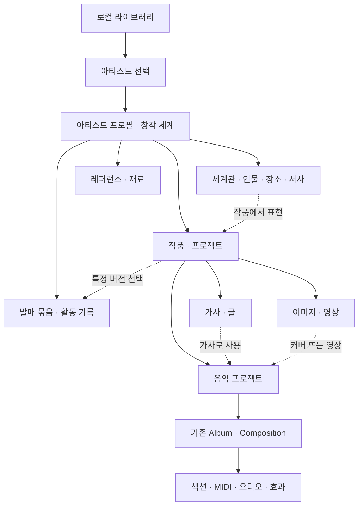

# 아티스트 프로필과 창작 세계

작성일: 2026-09-07 · 소유: product-manager · 상태: 제품 방향 확정, 세부 구조 제안

**circlr는 아티스트를 선택하고, 그 아티스트의 작품·세계관·자료·창작 과정을 하나의 원형 작업 공간에서 이어가는 도구를 지향한다.** 사용자는 게임의 캐릭터를 선택하듯 프로필을 만들고 들어간다. 음악을 만드는 DAW는 이 작업 공간의 음악 제작 기능으로 발전한다.

현재 앱 0.10.0은 앨범·송폼 궤도 편집기다. 이 문서는 향후 제품 모델이며 프로필, 통합 라이브러리, 텍스트·이미지·영상 기능이 구현됐다는 뜻은 아니다.

## 1. 확정된 방향과 이번 설계의 가정

| 구분 | 내용 |
|---|---|
| 사용자 확정 | 최종 목적은 한 아티스트의 모든 것을 관리하는 도구다. |
| 사용자 확정 | 아티스트 프로필을 생성하고 게임 캐릭터 선택 같은 방식으로 진입한다. |
| 사용자 확정 | 음악뿐 아니라 텍스트·영상·이미지를 통합하고 생성물을 종합적으로 관리한다. |
| 사용자 확정 | 서클은 의미 있는 궤도이며, 단일 dark canvas와 확대를 통한 편집을 유지한다. |
| 작업 가정 | 한 사람이 여러 활동명·프로젝트·페르소나를 관리할 수 있다. 첫 버전은 로컬 단일 사용자다. |
| 작업 가정 | 실존 개인·밴드·가상 아티스트 모두 같은 프로필 구조를 사용할 수 있다. 멤버별 로그인·공동 편집은 별도 과제다. |
| 작업 가정 | ‘모든 것’은 먼저 정체성, 창작물, 세계관, 제작 이력, 발매 묶음을 뜻한다. 일정·공연·홍보·정산 등 운영 정보는 이후 연결한다. |
| 미정 | 최초 관리할 실제 아티스트 이름·프로필 자료, 협업 범위, 운영 기능 우선순위, 출시 일정 |

프로필을 만들 때 음악 장르나 소개 문구를 확정하도록 강요하지 않는다. 아티스트의 방향은 작품과 함께 변할 수 있다. 장르·설정·메모는 사용자 기록이며 창작 가능성을 제한하는 규칙이 아니다.

## 2. 아티스트가 사용하게 될 구조



이 그림의 큰 갈래는 고정된 폴더나 별도 창을 요구하지 않는다. 같은 캔버스에서 필요한 관계를 찾아가는 접근점이다. 노트를 반드시 작품에 소속시키거나, 모든 곡을 발매용 앨범에 넣을 필요도 없다.

| 사용자 단위 | 예시 내용 | 역할 |
|---|---|---|
| 아티스트 프로필 | 활동명, 소개, 선택한 초상·로고, 정체성 메모 | 누구의 창작 세계인지 정하고 작업 범위를 구분 |
| 작품 | 곡, EP, 앨범, 영상, 글, 연작 | 여러 생성물과 버전을 하나의 창작 의도로 연결 |
| 생성물 | MIDI, 녹음, mix, 가사, 커버, 영상 편집본 | 실제 편집·미리보기·내보내기 대상 |
| 자료 | 샘플, 레퍼런스 이미지, 인터뷰 메모, 외부 링크 | 출처를 가진 재료. 아티스트의 저작물로 자동 분류하지 않음 |
| 세계관 요소 | 인물, 장소, 사건, 상징, 설정 | 여러 작품에서 재사용되는 의미와 관계 |
| 발매 묶음 | 특정 master·커버·가사·credit의 조합 | 어떤 버전들을 함께 내보냈는지 고정 |

프로필 정보와 창작물이 같은 자료를 참조할 수 있다. 예를 들어 프로필 초상은 이미지 생성물의 특정 버전을 사용하며, 이미지를 수정했다고 현재 초상이나 이전 발매 커버가 조용히 바뀌지 않는다.

## 3. 프로필 선택 경험

앱의 첫 진입점은 아티스트 선택이다. 원형 초상·로고와 활동명으로 프로필을 표시한다. 선택한 아티스트가 중심에 오고, **작업 시작**으로 그 아티스트의 마지막 작업 위치에 들어간다. 선택만으로 음악을 재생하거나 기존 작업을 교체하지 않는다.

1. 첫 실행에는 **아티스트 만들기**와 **기존 작업 가져오기**가 실제 가능한 진입점이 된다. 가짜 프로필·자동 생성 작품으로 화면을 채우지 않는다.
2. 새 프로필은 활동명만 필수다. 이미지·소개·장르는 나중에 추가한다. 이미지가 없으면 이름 중심의 원형 표식을 사용한다.
3. 진입하면 아티스트를 중심으로 작품과 관계가 나타난다. 기존 작업이 있으면 마지막 선택·확대 위치를 복원하고, 새 프로필은 첫 작품을 만들거나 자료를 가져올 수 있다.
4. 아티스트 이름을 통해 선택 화면으로 돌아간다. 펼친 서클·대화·선택은 프로필별로 복원한다. 긴 이름은 상세 접근으로 전체를 읽을 수 있어야 한다.
5. 많은 프로필은 검색과 키보드 이동으로 선택한다. 방향키로 선택, Enter로 진입, Esc로 이전 상태에 복귀한다. 움직이는 carousel에 선택을 의존하지 않는다.

캐릭터 선택의 핵심은 **정체성을 고르고 그 세계로 들어가는 감각**이다. 레벨·능력치·가짜 활동 점수는 요구 사항에 포함하지 않는다. 우주 비유는 포함과 궤도 탐색을 설명하는 데 쓰며, 자동 회전이나 배경 효과 때문에 편집 대상을 계속 쫓아가게 만들지 않는다.

### 전환과 상태

| 상태 | 기대 동작 |
|---|---|
| 빈 프로필 | “아직 작품이 없습니다”와 실제 작품 생성·가져오기 |
| 기존 미저장 문서 | 현재 문서를 먼저 보존. 저장 실패 시 전환 취소. 취소 가능한 전환 동작 |
| 재생 중 전환 | 새 아티스트 작업 시작 시 이전 transport를 정리. 프로필 선택 화면을 보는 것만으로 재생 상태를 바꾸지 않음 |
| 녹음 중 전환 | 녹음 종료·take 보존을 먼저 처리. 전환 때문에 take 유실 금지 |
| AI·렌더 작업 중 전환 | 작업 소유자를 표시하고 취소·정리 후 진입. 완료 응답을 새 아티스트의 작업으로 표시하지 않음 |
| 외장 디스크 분리 | 자료를 삭제하거나 빈 원본으로 대체하지 않음. “원본을 찾을 수 없습니다”와 다시 연결 |
| 이름이 같은 프로필 | stable ID로 분리. 이름 변경·경로 이동으로 다른 프로필과 합쳐지지 않음 |
| 프로필 보관 | 작품은 남긴 채 선택 목록에서 보관 처리. 원본 파일의 연쇄 삭제와 분리 |

계정 가입은 로컬 프로필 생성의 전제 조건이 아니다. Codex 로그인은 AI 기능을 사용할 때 연결한다. **아티스트 프로필은 OpenAI 계정이나 보안상 분리된 OS 사용자와 동일하지 않다.**

## 4. 서클과 궤도의 의미

모든 관계의 연결 위치는 [8방향 포트와 다중 입출력](22-eight-direction-ports.md)의 공통 조작을 따른다. IN/OUT과 포트 이름으로 방향·역할을 표시하되, 아티스트의 참조 관계와 실제 음악 신호의 실행 의미는 구분한다.

모든 주요 대상은 서클로 탐색하되, 각도와 테두리가 무엇을 뜻하는지 명확해야 한다. 다음 구분은 기존 [세계관 확장 제안](16-orbital-production-plan.md)의 시간 없는 콘텐츠를 구체화한 것이다.

| 궤도 종류 | 대상 | 의미 |
|---|---|---|
| 시간 궤도 | 음악, 오디오, 동영상, 명시적인 재생 묶음 | 길이, 위치, 반복. 음악은 박·마디와 실제 시간, 영상은 seconds/frame |
| 관계 궤도 | 아티스트, 작품 묶음, 자료, 세계관 | 포함과 연결. 위치를 옮겨도 음악 시간·발매일은 바뀌지 않음 |
| 명시적 cue | 가사·이미지·서사와 시간 콘텐츠의 연결 | 지정 구간에 보여주거나 사용. 원본 이미지·텍스트 자체에 임의 재생 길이를 부여하지 않음 |

상위 프로필에 BPM을 부여해 모든 작품의 tempo를 상속시키지 않는다. 현재 앨범의 글로벌 tempo·scale·meter는 해당 음악 문서 범위에 남는다. 아티스트의 선호 음악 설정은 새 작품 생성에 적용할 수 있는 **선택적 시작값**이며, 변경해도 완성된 곡을 재조율하지 않는다.

같은 캔버스에서 확대하면 음악은 기존 편집기, 글은 읽기·편집, 이미지·영상은 실제 미리보기와 해당 도구가 나타나는 방향이다. 내용의 가독성을 위해 글자나 영상 픽셀을 원호로 왜곡하지 않는다. 서클은 객체와 범위이며 상세 콘텐츠의 모든 픽셀이 원형일 필요는 없다. 미디어별 편집 기능은 별도 인수 기준을 충족한 순서대로 노출한다.

관계선은 종류를 가진다. **포함 / 참조 / 파생 / 작품에 사용 / 시간 동기화 / MIDI·오디오 신호**를 구분하고 텍스트로도 읽을 수 있게 한다. 커버를 곡에 연결했다고 오디오가 합산되거나 재생 순서가 바뀌면 안 된다. 관계 graph에는 순환 참조가 가능하지만 소유 계층과 음악 실행 graph는 각자의 유효성 규칙을 따른다.

## 5. 생성물 관리의 핵심 규칙

첫 목표는 “어느 것이 최신 파일인가”를 넘어서 **어디서 시작해 무엇으로 발전했고 어느 버전을 사용했는가**를 찾는 것이다.

- 작품의 정체성과 파일 이름을 분리한다. `f0r h3r`라는 작품은 작업 프로젝트, MIDI, 가사, cover, 여러 mix와 영상 등을 참조할 수 있다. 파일 이름을 바꾸어도 작품의 정체성은 유지한다.
- 생성물은 편집 가능한 원본·변경 버전·파생 출력으로 구분한다. bounce는 MIDI 원본을 없애지 않고, 영상 인코딩본은 편집 프로젝트를 대체하지 않는다. 모든 Undo 동작을 영구 버전으로 저장할 필요는 없으며 명시적 저장점과 출력 이력을 보존한다.
- 관계는 선택한 버전에 고정하는 것이 기본이다. “최신 버전 따라가기”는 별도로 선택한다. 발매 묶음은 항상 정확한 버전과 파일 hash에 고정한다.
- 아티스트별 관리 소속, 실제 작성자·참여자 credit, 사용 허락·출처를 별도 필드로 둔다. 라이브러리에 가져왔다고 저작권을 획득한 것으로 표시하지 않는다. 권리 정보는 기록이며 앱이 법적 판단을 자동 확정하지 않는다.
- 같은 자료를 여러 작품에서 쓸 수 있다. 다른 아티스트로 옮길 때는 참조·독립 복사·관리 소속 이전 중 의도한 작업과 영향을 표시한다. 공동 크레딧 추가는 관리 소속 변경이 아니다.
- 생성물을 보관하거나 관계를 제거해도 다른 작품이 사용하는 원본을 즉시 삭제하지 않는다. 영구 파일 정리는 역참조·보존 버전·발매 사용 여부를 확인한 별도 동작이다.
- 수동 작업과 AI 결과 모두 같은 생성물 계약을 사용한다. AI 결과에는 사용 도구·알려진 모델 정보·입력 참조·생성 시각·결과 버전을 기록할 수 있다. 비밀·계정 토큰은 provenance에 넣지 않는다.
- 제작 상태와 공개 상태를 나눈다. “완성” 또는 “발매 묶음 생성”은 인터넷 공개를 의미하지 않는다. 플랫폼 등록·배포는 후속 통합의 명시적 사용자 동작이다.

### f0r h3r로 확인할 흐름

실제 아티스트 프로필 이름은 아직 정하지 않았다. 이름을 임의로 만들어 사용자 아티스트로 등록하지 않는다. 향후 검증에서는 사용자가 선택한 프로필에 기존 [f0r h3r](../music/f0r-h3r/README.md) 작업을 연결한다.

1. 현재 `.circlr` 문서·8개 트랙 MIDI·WAV를 같은 작품의 생성물로 묶는다. 원본의 bytes와 편집 구조를 보존한다.
2. 이후 사용자가 만드는 가사·커버·영상은 실제 생성 시 추가한다. 아직 없는 자료를 완성된 생성물처럼 등록하지 않는다.
3. 한 커버 후보에서 사용된 레퍼런스를 찾고, 한 WAV에서 원본 프로젝트와 bounce 시점의 버전을 찾는다.
4. 발매용 master·커버·가사·credit을 골라 묶음을 만든다. 나중에 mix나 커버를 수정해도 이전 묶음은 재현된다.
5. 다른 아티스트 프로필로 전환해도 이 작품의 경로·맥락·대화가 섞이지 않는다.

## 6. 기본 데이터·저장 아키텍처 제안

기존 `Sources/CirclrCore/Model.swift`의 `Project`와 `AlbumModel.swift`의 `Album/Composition`은 음악 문서 모델로 유지한다. 모든 아티스트 데이터를 하나의 거대한 `.circlr` 문서나 audio graph에 넣지 않는다.

| 제안 모델 | 주요 내용 | 기존 모델과의 경계 |
|---|---|---|
| `ArtistProfile` | artistID, 활동명, 소개, portrait 참조, 시작 설정 | 음악 tempo·로그인 credential의 소유자 아님 |
| `ArtistWorkspace` | workspaceID, artistID, 작품·자료 관계, 마지막 탐색 위치 | `.circlr` 여러 개와 비음악 자료를 묶는 상위 catalog |
| `Work` | workID, 제목, 작품 유형, 제작 상태, 연결된 생성물 | 곡·영상·연작의 창작 의도. 음악 내부 Composition과 자동 1:1로 묶지 않음 |
| `Artifact` / `ArtifactRevision` | contentID, 종류, 버전, 원본·파생·미리보기 참조 | 기존 audio `Asset`을 비음악 만능 객체로 바꾸지 않음 |
| `FileObject` | 위치·hash·크기·가용성·앱 관리/외부 참조 방식 | 파일의 물리적 존재. contentID는 파일 이동 후에도 유지 |
| `WorldEntity` | 인물·장소·사건·상징·설정, 근거 작품 | 시각적 관계와 서사 정보. 음악 신호 graph와 별도 |
| `ContentRelation` | from/to, 관계 유형, 버전 정책, 선택적 cue | 역참조·영향 범위·시간 연결 조회 |
| `ReleaseSet` | 선택한 생성물의 고정 버전, credit, 기록 상태 | 나중의 원본 편집과 독립적인 내보내기 명세 |

### 저장 원칙

- 초기 기본값은 local-first다. 사용자 선택 라이브러리에 프로필·작품 metadata와 앱 관리 파일을 보관하고, 외부 파일 참조도 명시적으로 지원하는 안을 검토한다.
- profile/catalog metadata와 관계를 내구성 있는 원본으로 보관한다. 검색·썸네일·파형 cache는 재생성할 수 있어야 한다. SQLite catalog 등의 구체적 선택은 다음 기술 설계에서 migration·복구 검증과 함께 확정한다.
- 음악의 `musicRevision`, catalog revision, artifact version을 분리한다. 프로필 이미지 변경이 재생 계획을 다시 만들지 않으며, 음악 저장점과 출력 버전의 연결은 기록한다.
- 라이브러리 등록은 기존 파일을 기본적으로 재작성하지 않는다. 사용자 선택에 따라 위치를 참조하거나 독립 사본을 만들고 missing media를 연결한다. 등록 철회는 원본 삭제가 아니다.
- 기존 `.circlr`는 라이브러리 없이 단독으로 열 수 있게 유지한다. catalog 장애 때문에 기존 곡을 열지 못하는 구조는 피한다.
- 첫 단계는 기존 파일 등록이다. 새 버전 출력 추적 단계에서는 이후 저장·bounce의 provenance를 추가한다. 과거 WAV에 생성 당시 프로젝트 버전을 추정해 채워 넣지 않는다. 확인되지 않은 관계는 미확인으로 기록한다.
- 발매 묶음 내보내기는 필요한 파일과 버전 명세를 완성한 후 게시한다. 외부 링크만 남아 깨진 묶음을 성공으로 표시하지 않는다. 샘플 포함 여부는 사용 범위와 출처를 확인하는 단계로 다룬다.

## 7. 아티스트 문맥과 AI

[Codex 계정 콘솔 계획](20-codex-account-console-plan.md)에 아티스트 작업 범위를 더한다. 하나의 OpenAI 연결로 여러 아티스트를 작업할 수 있지만, 그 사실만으로 각 프로필의 자료·대화를 서로 사용할 수 있는 것은 아니다.

- 대화와 실행권한은 `artistID + workspaceID + documentBinding + projectID + threadID`에 연결한다. 음악 쓰기의 revision 검사와 비음악 catalog의 revision 검사는 따로 유지한다.
- 선택한 아티스트의 소개·설정·작품 중 필요한 자료만 문맥으로 제공한다. 아티스트의 취향은 편집 참고이며 사용자의 현재 요청을 덮는 명령이 아니다.
- 프로필 전환 시 이전 lease를 회수하고 활성 AI·그 소유 job을 정리한다. 새 프로필에서 이전 결과를 붙이거나 이전 대화를 자동 이어가지 않는다. 장차 여러 프로필의 동시 작업을 허용하려면 명시적인 작업 소유자 UI가 먼저 필요하다.
- 아티스트 간 자료 참조는 사용자가 선택한 공유 범위를 따른다. 계정에 로그인한 것만으로 전체 디스크·모든 프로필을 모델 문맥에 넣지 않는다.
- “이 아티스트의 두 번째 싱글과 관련된 글·커버 후보를 보여줘”처럼 관계 조회부터 확장한다. native 편집기가 없는 형식의 편집·생성을 AI가 지원한다고 표시하지 않는다.

## 8. 로드맵과 인수 기준

기존 음악 제작 기능의 품질을 유지하며 관리 범위를 넓힌다. 날짜·인력 추정은 아직 없고, 아래 순서는 의존성과 사용자 가치에 따른 제안이다.

| 단계 | 사용자에게 생기는 가치 | 완료 조건 | 다음 소유자 |
|---|---|---|---|
| A · 아티스트 프로필 | 누구의 작업인지 선택하고 이어감 | 생성·이름 변경·진입·전환·보관·위치 복원. 기존 곡 등록 시 파일 hash 보존 | product-owner → native integration |
| B · 작품·생성물 catalog | 하나의 작품에서 프로젝트·출력·자료를 찾음 | 파일 등록·조회·실제 미리보기·검색·다시 연결·버전·역참조. 레퍼런스와 창작물 구분 | architecture → catalog/native |
| C · 세계관·복합 미디어 | 설정과 가사·이미지·영상을 작품에 연결 | 인물·사건 관계, 텍스트 편집, cue와 media timebase 계약. 영상 미리보기와 영상 편집 지원을 별도로 검증 | UI/UX → media integration |
| D · 아티스트별 AI 작업 | 선택한 프로필의 자료로 대화·편집 | Codex 콘솔의 인증·도구 계약과 A/B 기반. 프로필 간 누출·잘못된 대상 쓰기 0건 | agent integration → QA |
| E · 발매·활동 관리 | 무엇을 어떤 버전으로 내보냈는지 보존 | 고정 버전 묶음·credit·파일 가용성·export 재현. 실제 배포와 로컬 기록 구분 | product-owner → release workflow |

D의 음악 대화 기능은 기존 계획대로 별도 진행할 수 있다. A/B 이후 아티스트 문맥을 연결한다. 공연·일정·홍보·정산·외부 서비스 통합은 E 이후의 우선순위 검토 대상이며, 이번 결정으로 모두 구현 범위에 들어간 것은 아니다.

후속 설계 경로는 `Sources/CirclrLibrary/`의 별도 domain/store 모듈, `Sources/CirclrApp/ArtistSelectionView.swift`, `ArtistWorkspaceStore.swift`, `ArtistCanvas.swift`, `Tests/CirclrLibraryTests/`를 후보로 한다. 아직 없는 파일이다. 엔지니어링 착수 시 실제 파일 경계·migration·저장 계약을 확정한다.

QA는 프로필 2개와 동일 이름/복사 파일, 오프라인·디스크 분리, 미저장/녹음/AI 중 전환, 참조 중인 파일의 보관, 발매 버전 고정, camera 복원과 Korean IME·VoiceOver를 검증한다. 실제 사용자 아티스트 자료는 사용자가 등록할 때 사용하고 fixture는 격리된 QA 자료로 유지한다. 첫 native 인수 크기는 1440×900과 1024×768이며 mobile 제품은 별도 범위다.

## 9. 설계 인계

```text
TEMPLATE_VERSION: ux-brief-v1
BRIEF_REVISION: artist-universe-1
PRODUCT_SURFACE: 아티스트 선택과 단일 창작 캔버스
TARGET_USER: 자신의 작품과 정체성을 함께 관리하는 아티스트
PRIMARY_GOAL: 아티스트를 선택하고 관련 창작물의 문맥을 유지하며 작업한다
CURRENT_FRICTION: 현재 앱의 최상위 범위는 음악 문서이며 아티스트 단위 관리가 없다
ENTRY_POINTS: 아티스트 선택, 기존 .circlr 열기
KEY_STATES: 빈 프로필, 작업 복원, 미저장, 녹음, AI 진행, missing media, 보관
INTERACTION_MODEL: 프로필 선택 → 작업 시작 → 작품과 관계 탐색 → 확대 편집 → 생성물 연결
USABILITY_RISKS: 게임식 과도한 움직임, 프로필과 계정 혼동, 관리 소속과 저작권 혼동, 관계와 시간 혼동
NON_GOALS: 이번 턴의 코드 구현, 전체 운영 기능, 일반 사용자 계정 서비스
RECOMMENDED_NEXT_OWNER: product-owner
OPEN_QUESTIONS: 실제 아티스트 자료, 공동작업 범위, 운영 기능 우선순위, 출시 일정
```

```text
TEMPLATE_VERSION: ux-handoff-v1
HANDOFF_REVISION: artist-universe-1
TARGET_ROLE: development-lead
INPUT_BRIEF_REVISION: artist-universe-1
GOAL: A 단계의 데이터 보존과 전환 계약을 구현 가능한 범위로 확정한다
FLOW_SUMMARY: 생성 → 선택 → 기존 작업 등록 → 마지막 위치 진입 → 다른 프로필 전환
STATE_REQUIREMENTS: 미저장·녹음·AI 작업을 정리하고 성공한 전환만 활성 프로필로 확정
INTERACTION_RULES: 동일 canvas, 명시적 진입, 자동 재생 없음, 프로필별 작업 상태
VISUAL_NOTES: 원형 정체성 표식, 이름과 선택의 명확성, 다크 모드, 정지한 궤도, 키보드 탐색
IMPLEMENTATION_NOTES: 기존 .circlr 독립 사용 유지, catalog와 audio 모델 분리, 이번 산출물은 문서만
ACCEPTANCE_CHECKS: 원본 hash 보존, 프로필 간 쓰기 격리, 전환 실패 복구, 위치 복원, 접근성
OPEN_QUESTIONS: catalog 저장·백업 포맷은 architecture 검토에서 확정
```
