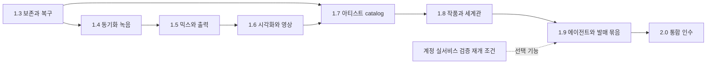

# circlr 1.3–2.0 상세 개발 계획

작성: 2026-09-30 · 기준: 1.2.0/build253, source `ca00aa0`, 출고 기록 `e499d9c` · 갱신: 2026-09-30 · 상태: 1.3 IN_PROGRESS / 1.4–2.0 PLANNED

이 문서는 향후 구현 계약이다. 완료 기능이나 출시 일정을 뜻하지 않는다. 버전별 현재 상태는 [로드맵](roadmap.md), 실제 출시 절차는 [운영 규약](README.md)을 따른다. 과거 설계와 충돌하면 이 계획의 범위·순서를 우선하며 사용자 최신 지시는 항상 우선한다.

## 1. 2.0에서 완성할 사용자 경험

**아티스트를 선택하고, 곡을 구성·녹음·편집·믹스한 뒤 가사·이미지·영상과 함께 하나의 작품 버전으로 보관하고 내보낸다.** 에이전트는 같은 데이터 계약을 통해 백그라운드에서 작업하며 사용자는 콘솔에서 대상·진행·변경·취소 결과를 확인한다.

써클러의 기준은 다음과 같다.

- 서클은 시간과 관계를 표현하는 궤도다. 시간 없는 자료 관계를 임의의 마디나 재생 순서로 해석하지 않는다.
- 다크 모드의 단일 freeform canvas에서 확대·이동한다. 영구 좌우·하단 편집 패널을 추가하지 않는다. 콘솔은 접을 수 있는 작업 모니터로 유지한다.
- 모든 조작은 메뉴·키보드로 접근한다. 자동 정렬·follow는 사용자의 직접 조작을 방해하지 않는다.
- 계정 없이 로컬 음악 제작·저장·내보내기가 가능하다. 아티스트 프로필은 서비스 로그인 계정과 다르다.
- 이미 있는 기능을 다시 만들지 않고, 실제 제작을 막는 동작·보존·성능 결손을 개선한다.
- 기존 `.circlr`를 아티스트에 등록하지 않고도 계속 열 수 있다. 새 관리 계층 때문에 기존 곡을 강제 변환하지 않는다.

2.0의 인수 시나리오는 ‘기능 버튼이 존재한다’가 아니다. 아티스트 A에서 MIDI와 오디오를 녹음하고, verse/chorus 변형을 배치하고, 루프 편집·믹스·바운스를 마친 뒤 가사·커버·영상의 특정 버전을 발매 묶음으로 내보낸다. 앱을 종료·재실행해 동일한 자료와 버전으로 복원하고, 아티스트 B로 전환해도 A의 파일과 에이전트 작업이 섞이지 않아야 한다.

## 2. 확인한 출발점과 기술적 결손

| 영역 | 1.2에서 있는 것 | 앞으로 해결할 부분 |
|---|---|---|
| 송폼·MIDI | 궤도·섹션 공유/삽입·편곡안, step/pitch-bend/sustain 편집, clipboard, 커서 재생 | 반복 실작업에서 선택·범위·공유 의미의 혼동과 회귀, 대형 곡 접근성 |
| 재생 | song/section loop, 경계 교체, output worker와 장치 선택 | 장시간 재생·동시 작업·장치 장애에서 복구 계약과 실측 |
| 녹음 | MIDI/audio take, 원본 보존·take 복원 | 녹음 시작이 기존 재생을 정지함. 공통 clock 기반 overdub·count-in·latency 보정 필요 |
| 음색·믹스 | 내장 synth, effects, AU worker, automation, bounce/restore | 지연 경로의 정렬, 플러그인 실패/상태 복원, 믹스와 stem 출력의 일관성 |
| 저장 | 기존 recovery·원자적 저장·세션 media 관리 | 실패 주입과 미디어 이동/누락/디스크 부족을 포함한 사용자 복구 동선 |
| 영상 | canvas+audio 녹화, follow/감상 모드 | 기존70ms frame interval FAIL, 장시간 A/V 동기와 실제 화면 FPS 미검증 |
| 자료 관리 | 음악용 media library·작품 문서 | 아티스트 catalog, 작품/자료 버전·관계·라이선스 관리 미구현 |
| AI | 로컬 MCP·명령 콘솔; 계정 연결 코드는 보존 | 계정 대화 UI 비활성. 모델 실작업 검증 보류, 아티스트 범위/변경 검토 확장 필요 |

증거: [1.2 QA](../../qa/1.2-production-workflow.md), [원격 출고](../../qa/1.2-release-verification.md). 물리 청취·Scarlett 호환성·광범위 IME/VoiceOver를 이미 통과한 것으로 가정하지 않는다.

## 3. 버전 순서와 의존성

| 버전 | 한 문장 목표 | 선행 조건 | 완료해야 다음으로 넘어갈 결과 |
|---|---|---|---|
| 1.3 | 작업을 잃지 않고 문제에서 복구한다 | 1.2 회귀 기준 | 저장/미디어/복구와 작업 상태를 실제 장애 시나리오로 확인 |
| 1.4 | 반주를 들으며 정확히 녹음한다 | 1.3 문서·복구 계약 | 공통 clock, count-in, overdub, 입력 보정, take 보존 |
| 1.5 | 믹스와 출력물이 일치한다 | 1.4 clock/latency | 지연 보정·AU 복원·automation·bounce/stem 결과 검증 |
| 1.6 | 궤도 재생을 매끄럽게 보고 영상으로 쓴다 | 1.5 출력 기준 | 성능 budget·30fps 영상·A/V 동기·portrait 조작 검증 |
| 1.7 | 아티스트별 작품과 자료를 안전하게 관리한다 | 1.3 저장, 1.6 탐색 | catalog·profile 전환·미디어 재연결·기존 곡 무손실 등록 |
| 1.8 | 가사·이미지·영상과 세계관을 작품에 연결한다 | 1.7 asset/identity | 실제 미리보기·텍스트 편집·관계·cue·버전 고정 |
| 1.9 | 에이전트와 발매 준비를 안전하게 함께 수행한다 | 1.7 범위, 1.8 버전 | 작업 검토/취소·프로필 격리·고정 발매 묶음 출력 |
| 2.0 | 위 작업을 하나의 완성된 흐름으로 제공한다 | 1.3–1.9 필수 gate | migration·통합 제작·실기기·접근성·배포 인수 |

독립 설계·fixture 작성은 병렬로 할 수 있다. 예를 들어 1.4 개발 중 1.7 catalog schema를 설계할 수 있지만 두 버전의 사용자 기능을 한 릴리스에 섞지 않는다. 1.2.x는 재현된 데이터 손상·크래시·심각한 회귀만 최소 수정하며 계획된 신규 기능을 우회 출시하지 않는다.

## 4. 버전별 실행 계획

### 1.3 · 보존·복구와 기본 조작 신뢰성

사용자 결과: 편집·저장 중 오류가 나도 마지막 정상 작품을 찾고 작업을 재개한다.

| 작업 ID | 필수 작업 | 구현 계약·소유 영역 |
|---|---|---|
| R130-01 | 기준 곡·장치·시나리오 고정, 진단 묶음 | QA가 재생/편집/저장/종료의 이전·이후 상태를 기록. 진단은 사용자가 내보내며 자격증명·오디오 원본·전체 경로는 기본 제외 |
| R130-02 | recovery/저장 실패 복구 강화 | 기존 recovery를 확장. 저장 중 종료·권한 오류·디스크 부족에서 이전 유효본 보존, 복구 선택과 취소, 성공 전 dirty 해제 금지 |
| R130-03 | 누락 미디어 찾기·재연결·프로젝트 수집 | 원본 이동/외장 디스크 분리를 표시. hash/크기/형식 확인, 동일 이름 자동 대체 금지, 복사 저장 전 전체 크기/권한 검증 |
| R130-04 | 일관된 편집·작업 상태와 키보드 | 재생에 반영된 revision/준비 중 revision 구분, 입력 draft·IME·Undo·창 닫기 경계,700pt에서도 핵심 동작 접근 |

기존 소스: `Sources/CirclrCore/ProjectStore.swift`, `SessionMedia.swift`, `Sources/CirclrApp/AppStore.swift`, `LiveLoopUpdate.swift`, `MIDIClipboardWorkspace.swift`, `Sources/CirclrApp/MediaLibraryController.swift`. 새 파일은 실제 결함 범위를 확인한 뒤 별도 coordinator/extension으로 분리하며 AppStore 전체 재작성을 하지 않는다.

인수: 최소20개 장애 fixture에서 마지막 유효 프로젝트·asset hash 보존, 편집→Undo/Redo→저장→cold reopen 동일성, 실제 missing-media 재연결, 한글 조합 중 저장/단축키 분리, 700×900/1440×900 창. 복구 성공은 실제 파일 재열기로 확인한다. 기존 복구 기능에 문제가 없는 경로는 계측·검증만 추가한다.

제외: 새 녹음 엔진, 프로필, 음악적 time-stretch, 클라우드 백업. [착수용 세부 계획](1.3.0.md).

### 1.4 · 공통 transport와 동기화 녹음

사용자 결과: 섹션을 반복 재생하면서 MIDI 또는 오디오를 새 take로 녹음하고, 반주와 맞는 결과를 선택한다.

| 작업 ID | 필수 작업 | 계약 |
|---|---|---|
| R140-01 | transport/clock 정리 | output frame·host time·song beat·local section beat 변환을 하나의 계약으로 정의. count-in 음수 위치는 작품에 저장하지 않음 |
| R140-02 | 메트로놈·1/2마디 count-in | global/local 박자와 강세 지원. 모니터용 click을 master/bounce에서 기본 제외 |
| R140-03 | MIDI overdub와 loop take | 재생을 멈추지 않고 녹음. append/replace를 사전 선택, loop 경계 note-off/페달/bend 정책과 take별 source 보존 |
| R140-04 | 오디오 overdub와 보정 | 시작/종료 frame, 장치 latency/사용자 보정값, sample-rate 변화, recording chunk 회수. 첫 범위는 선택한 한 트랙의 mono/stereo 입력 |
| R140-05 | 녹음 실패·취소·장치 해제 | take finalize/recovery를 마친 뒤 문서 전환. 출력 장애가 입력 파일 삭제로 이어지지 않음 |
| R140-06 | 연주 모니터와 표현 | 녹음되는 notes·CC64·pitch bend가 모니터와 재생에서도 같은 의미를 갖도록 연결. 초기 지원 bend range는 ±2 semitone으로 고정하고 미지원 RPN을 명시. pedal-up/STOP 후 stuck voice0건 |

기존 앵커: `Sources/CirclrApp/AppStore.swift`, `RecordingWorkspace.swift`, `RecordedTakeWorkspace.swift`, `Sources/CirclrAudio/PlaybackTransport.swift`, `OutputWorkerProtocol.swift`; `Sources/CirclrAudio/InputCaptureWorkerHost.swift`, `Sources/CirclrCore/RecordedTakeSummary.swift`를 함께 검토한다. 제안 신규 계약은 `Sources/CirclrCore/RecordingClock.swift`, `Sources/CirclrAudio/RecordingTransport.swift`이며 현재 존재하는 파일로 간주하지 않는다.

1.4 지연 지원 범위: 정확도 인수는 plug-in을 통과하지 않는 dry 입력과 zero-latency 반주 경로를 기준으로 한다. AU가 지연을 만드는 경로는 미보정 상태를 명시하고, 해당 경로에서 5ms 정렬을 보장한다고 표시하지 않는다. 장치 latency와 사용자 보정은 1.4가 소유하며 plug-in graph PDC는 1.5가 소유한다. 같은 지연을 두 번 차감하지 않도록 보정 항목별 단위·적용 지점·유효 기간을 clock ADR에 기록한다. 1.5에서는 AU 반주를 포함한 overdub 정렬을 다시 인수한다.

모니터링 계약: 오디오 software monitoring은 선택 트랙의 dry 입력 경로부터 구현하고 기본값은 off로 둔다. 사용자가 장치 direct monitoring과 앱 monitoring 중 원하는 경로를 명시적으로 선택한다. 앱 내부의 중복 monitor 경로·feedback routing을 만들지 않으며, 모니터 on/off가 저장 take의 gain·시간·원본을 바꾸지 않아야 한다. MIDI 모니터의 페달·bend와 take 재생을 별도로 검증한다.

장치 장애 계약: 입력/출력 해제·sample-rate 변경·sleep 진입 시 새 예약을 중지하고 가능한 take를 먼저 보존한다. wake/재연결 뒤 장치와 포맷을 재검사하고 사용자가 재시작한다. 선택하지 않은 다른 장치로 조용히 전환하거나 과거 PCM을 자동 재생하지 않는다. UI와 실제 transport 상태 일치, 종료 후 helper/socket0을 검사한다.

인수: 10분 48kHz 가상 timestamp fixture에서 누적 위치 오차1 sample 이하; 44.1/48kHz conversion round-trip; 지정 reference 장치 loopback에서 보정 후 입력/출력 정렬 절대 오차5ms 이하,10분 시작/끝 오차 변화2ms 이하를 목표 gate로 고정한다. 실제 수치는 구현 결과가 아니라 제안 인수 기준이다. 20회 loop take에서 누락/중복 note·원본 유실0건. 박자 변경·템포 변화·반복 경계·한글 이름 입력을 포함한다.

제외: 다중 인터페이스 동기화, aggregate-device 지원 보장, 다중 트랙 동시 오디오 입력, 실시간 pitch correction, comping 전용 편집기. 물리 loopback 확인 전에는 정확한 동기화 녹음이 검증됐다고 출시하지 않는다.

### 1.5 · 믹스·악기·플러그인과 출력 일관성

사용자 결과: 실제로 듣는 편곡과 bounce/stem 결과를 믿고 다른 도구로 전달한다.

| 작업 ID | 필수 작업 | 계약 |
|---|---|---|
| R150-01 | 신호 경로·지연 정렬 | 지원하는 acyclic 경로의 plug-in latency, parallel bus/sidechain 보정. 연결 불가·feedback은 명확히 거절 |
| R150-02 | AU state·실패 격리 | 저장한 state 복원, missing plug-in 교체/재검색, worker crash·timeout·취소. 원본 state를 자동 초기화하지 않음 |
| R150-03 | automation와 렌더 일치 | 기존 gain/pan/filter 등을 재생/바운스에 동일 적용. 편집 범위·곡선 보간·loop 경계 규칙을 검증 |
| R150-04 | master/stem export·freeze 복구 | sample rate/bit depth/tail과 공유 send 포함 정책을 표시. stem별/전체 scope·파일명 충돌·부분 실패 재시도, 원본 복원 |
| R150-05 | 내장 음색의 제작 적합성 | 기존 preset을 level match로 비교. aliasing/DC/클릭/voice stealing/CPU를 측정하고 실제 음악 문맥 청취로 보완 |

기존 앵커: `Sources/CirclrCore/SectionGraphCompiler.swift`, `BounceEditing.swift`, `SynthPresets.swift`, `Sources/CirclrAudio/AutomationDSP.swift`, `AUInstrumentWorkerProcess.swift`, `AUEffectWorkerProcess.swift`, `Sources/CirclrApp/TrackBounceButton.swift`.

인수: deterministic 내부 악기·효과에서 live renderer와 offline PCM 일치; 의도적으로 삽입한 latency 경로의 impulse 정렬1 sample 이하; stem solo와 해당 scope 렌더 일치. nonlinear master/랜덤 AU 때문에 stem 합이 master와 같지 않은 경우 출력 정책으로 분리한다. 지원 AU 표본에서 저장/재열기/crash복구를 확인하고 ‘모든 AU 호환’을 주장하지 않는다. 음색은 전문 역할별 청취 의견과 수정 이유를 기록하며 자동 점수를 ‘발매 가능한 음악’ 인증으로 쓰지 않는다.

제외: VST/AAX, AU 전수 호환, 임의 오디오 feedback, 모든 plugin parameter의 실시간 automation. 구간별 take comping과 고급 time-stretch/warp는 2.0 이후 후보로 남긴다. 필요한 capability부터 넓힌다.

### 1.6 · 재생 성능과 영상 결과물

사용자 결과: 재생 중 화면을 탐색하고 감상 모드와 follow를 사용하며, 끊김과 동기 오차를 측정한 영상을 만든다.

| 작업 ID | 필수 작업 | 계약 |
|---|---|---|
| R160-01 | 성능 baseline·render 분리 | 화면 draw/표시 FPS/output deadline/video PTS를 각각 계측. 노트·파형·포트·로그의 invalidate/cache 경계 분리 |
| R160-02 | 큰 곡·선택·follow 최적화 | offscreen culling, 줌별 detail, 연결/label 밀도. 직접 pan 후 follow 중지, section 전환 효과와 Reduce Motion |
| R160-03 | 실시간 녹화의 bounded pipeline | frame queue 상한·backpressure·종료 drain·디스크 부족, 보이는 drop/실패 상태. 오디오 thread에서 영상 인코딩 금지 |
| R160-04 | 고정 시간 영상 export | 화면 캡처 속도와 분리된 offline timeline frame export. 시각화·오디오가 동일 execution snapshot 사용 |
| R160-05 | 감상·비율·키보드 통합 | 텍스트 숨김, 곡/섹션/pinned follow, 16:9/9:16 출력, 700pt portrait toolbar와 editor 접근 |

기존 앵커: `Sources/CirclrApp/CanvasFrameTiming.swift`, `CanvasMovieCapture.swift`, `MovieRecording.swift`, `AlbumCanvas.swift`, `Sources/CirclrAudio/CanvasMovieWriter.swift`.

인수: reference Mac/디스플레이/OS와 QA 곡을 고정한다. 일반 곡32 tracks/64 section uses, stress 곡64 tracks/120 uses·전체10만 notes를 별도 fixture로 사용한다. 60Hz에서 일반 곡의 실제 표시 frame interval p95≤33.3ms, 원인불명500ms 이상 멈춤0건, 오디오 underrun0건/10분을 제안 gate로 삼는다. stress 결과는 별도 지원 한도로 명시하고 평균으로 일반 곡 실패를 숨기지 않는다.

영상 gate: 1080p30/10분, offline export 일정 PTS·누락0, 실시간 녹화 max PTS gap≤66.67ms·A/V 시작/끝 오차≤20ms·성공 finalize. 기존70ms FAIL은 같은 재현 조건에서 재검해야 해소된다. 실제 compositor·파일 PTS를 검사하며 내부 frameCount만으로 PASS 처리하지 않는다. 4K60·HDR은 제외한다.

### 1.7 · 아티스트 프로필과 작품 catalog

사용자 결과: 여러 활동명의 작품을 구분하고 원본 파일을 유지한 채 검색·등록·재연결한다.

| 작업 ID | 필수 작업 | 계약 |
|---|---|---|
| R170-01 | catalog/identity와 migration | Artist/Work/Artifact/ArtifactVersion/Relationship를 음악 문서와 분리. stable ID, 스키마 버전, 백업/복원·참조 무결성 |
| R170-02 | 프로필 선택·전환 | 활동명만 필수, 생성/이름변경/보관/복원/검색·키보드. 녹음·저장·렌더·에이전트 작업의 소유 범위 유지 |
| R170-03 | 기존 곡 등록·미디어 관리 | copy-managed와 linked-external을 명시. hash·media type·길이·출처·권리·실제 파일 위치를 별도 관리 |
| R170-04 | 아티스트 작업 복원 | 선택·카메라·최근 작품·검색 상태를 프로필별 복원. 공통 device 설정과 분리 |

기존 앵커: `Sources/CirclrCore/ProjectStore.swift`, `SessionMedia.swift`, `Sources/CirclrApp/MediaLibraryController.swift`, `AgentSessionGateway.swift`. 제안 신규 모듈: `Sources/CirclrLibrary/`, `Tests/CirclrLibraryTests/`; 신규 `ArtistSelectionView.swift`, `ArtistWorkspaceStore.swift`는 설계 후 추가한다. 저장소는 versioned SQLite catalog + 기존 `.circlr`/managed asset 파일을 초기 제안으로 하되 검색·atomic migration 시험으로 ADR을 확정한다. SQL schema를 음악 document schema에 섞지 않는다.

Linked 자료의 version 계약: linked-external 등록은 위치·hash를 추적하는 참조다. 외부 원본이 변경·삭제되면 기존 version을 unavailable로 표시하고 새 내용으로 조용히 대체하지 않는다. 사용자가 불변 version 고정 또는 발매 묶음을 요청하면 원본을 검증하여 managed snapshot으로 수집한 후 version을 확정한다. 이미 동일한 권한 범위의 검증된 managed blob이 있으면 중복 복사를 피한다. 용량·읽기 실패 시 고정을 완료하지 않는다. 같은 경로 덮어쓰기·삭제·복구 뒤에도 이전 version/hash와 새 version을 구분하는 것이 1.7의 필수 인수다.

Runtime 소유권 계약: 1.7은 catalog별 단일 writer를 기본으로 설계한다. 두 번째 앱 process는 읽기 전용으로 열거나 명확한 사용 중 안내를 제공하고, managed blob 게시·reconciliation·orphan 정리는 writer 소유 아래에서만 실행한다. 잠금은 PID 존재만으로 해제하지 않으며 crash 뒤 소유권 재획득과 journal 복구를 검사한다. 정확한 잠금 방식은 R170-01 ADR에서 확정하고 두 process 동시 접근·종료·재시작을 인수한다.

Catalog/파일 commit 계약: asset을 임시 경로에 staging하고 hash 검증 후 최종 managed 경로로 원자적 이동한다. 파일이 준비된 뒤 SQLite transaction으로 version/참조를 commit하고 staging journal을 정리한다. 파일 이동과 DB commit은 하나의 transaction이 아니므로 재시작 reconciliation이 누락/미참조 파일을 구분한다. 각 단계의 강제 종료를 검사하며, 존재하지 않는 파일을 정상 version으로 표시하지 않는다. Orphan 정리는 모든 작품·version·진행 job의 참조를 다시 확인한 후 복구 가능한 보관을 먼저 수행한다. 기존 외부 `.circlr` 등록은 이 과정 때문에 원본을 강제 migration하지 않는다.

인수: 두 artist의 동일 이름 작품·동일 파일 중복 등록·권한 변경·외장 디스크 분리·10,000개 catalog item 검색. reference hardware에서 색인 완료 후 검색 p95≤200ms를 목표로 한다. 기존 프로젝트 hash 보존; catalog 손상 후 백업 복원; 전환 중 이전 task가 새artist에 쓰는 경우0건. asset archive와 실제 파일 삭제를 분리하고 참조 중 파일의 물리 삭제는 안전한 명시 절차 없이는 수행하지 않는다.

제외: 사용자 가입 서비스, 클라우드 동기화, 실시간 공동 편집, 팀 권한/정산. [원래 제품 방향](../21-artist-universe.md)을 이 버전의 실행 범위로 좁힌다.

### 1.8 · 텍스트·이미지·영상과 세계관 관계

사용자 결과: 가사와 설정을 편집하고, 실제 커버·영상 자료를 작품의 특정 부분에 연결한다.

| 작업 ID | 필수 작업 | 계약 |
|---|---|---|
| R180-01 | 텍스트 작품·가사 | UTF-8/Markdown 기본 편집, 제목/본문 검색, revision·Undo·IME·저장. 텍스트를 이미지로 렌더링해 편집하는 방식 금지 |
| R180-02 | 이미지·영상 등록/미리보기 | 지원 형식·metadata·thumbnail cache·실제 원본 미리보기. 외부 URL과 로컬 asset 구분, 누락 복구 |
| R180-03 | 세계관 관계 그래프 | ‘가사로 사용’, ‘커버 후보’, ‘등장’, ‘영감’ 등 typed 관계와 역참조. 관계 연결이 음악 routing을 변경하지 않음 |
| R180-04 | 음악 cue 연결 | cue anchor는 song/section use와 beat 또는 media seconds 중 명시. 템포 변경 시 musical cue만 재계산; section 삭제는 orphan 경고/재연결 |
| R180-05 | 작품 버전 비교·고정 | 가사/커버/영상 후보 version 선택, 원본 import 보존. 새 후보가 과거 발매 참조를 바꾸지 않음 |

신규 제안: `Sources/CirclrLibrary/ArtifactVersion.swift`, `Relationship.swift`, `CueAnchor.swift`; App의 `TextArtifactEditor.swift`, `MediaArtifactPreview.swift`. 기존 궤도 canvas와 검색/작업 전환 규칙을 확장한다. 텍스트·이미지 관계는 시간 없는 그래프, 음악은 beat timeline, 영상은 rational media time으로 구분한다.

인수: 실제 읽기 가능한 가사·이미지·영상 파일로 생성→편집→저장→재열기→export; 한글 조합/긴 텍스트; 동일자료 역참조; 템포변경 후cue정렬; 권리 unknown 자료 경고/누락파일 복구. 서로 다른 두 버전을 선택해도 과거 참조 hash가 유지된다.

제외: 전문 영상 NLE, 이미지 페인팅/리터칭, 내장 이미지·영상 생성 서비스, 외부 링크 콘텐츠 자동 수집. 미리보기와 편집 지원을 명확히 구분한다.

### 1.9 · 에이전트 제작과 발매 묶음

사용자 결과: 에이전트에게 범위가 정해진 작업을 맡기고, 검토한 결과의 정확한 버전을 출력한다.

| 작업 ID | 필수 작업 | 계약 |
|---|---|---|
| R190-01 | 범위 있는 MCP/작업 lease | artistID/workID/projectID/revision과 capability를 명시. document 전환/STOP/cancel 이후 늦은 쓰기 거절, 요청 중복·재연결 idempotency |
| R190-02 | 제안→미리보기→적용 | 큰 작업을 draft/batch로 만들어 diff·affected circles·대략적 자원 범위를 표시. 적용은 atomic Undo, 오류는 원본 보존 |
| R190-03 | 전문 역할 packet | producer/arranger/performer/beatmaker/topliner/sound designer/mix/master 역할의 입력·출력·소유 범위·인계·실패 정책을 기존 studio kit에 통합 |
| R190-04 | 콘솔과 작업 예산 | 실행/대기/취소/완료와 실제 대상 표시, 제한된 로그·민감정보 비노출. 호스트가 제공하는 사용량과 자체 추정치를 구분 |
| R190-05 | 발매 묶음 manifest/export | master·stem·MIDI·가사·커버·영상·credit의 선택 version/hash를 고정, 권리/누락 검사, ZIP+manifest+checksum. 외부 배포는 별도 명시 동작 |

기존 앵커: `Sources/CirclrApp/AgentWorkspace.swift`, `AgentSessionGateway.swift`, `AgentConsole.swift`, `Sources/CirclrCore/AgentRunLease.swift`, `mcp/server.py`, `Resources/Codex/`. 신규 catalog tool은 1.7/1.8 API 위에 추가하고 AppStore 내부에 별도 자료 저장 구현을 복제하지 않는다.

인수: 외부 에이전트의 ‘선택 chorus 변형→새 take/편곡안→bounce→발매 묶음 준비’ 실제 workflow, STOP/프로필전환/중복요청/프로세스재시작/실패주입. 권한 밖 수정·오염0건, 적용 전후 hash와 Undo 대조. 동일 고정입력의 deterministic 내부 렌더/manifest 재현, 비결정적 AU의 출력은 hash로 고정한 실제 생성본을 참조한다.

Atomic 적용 범위: 1.9의 한 번 Undo는 하나의 음악 문서 draft batch에 한정한다. catalog 등록·발매 묶음 게시와 음악 편집을 하나의 원자 transaction으로 표시하지 않는다. 여러 저장 영역에 걸치는 작업은 문서 적용, artifact 등록, export를 별도 단계와 영속 job 상태로 기록하고 중단 후 재시도·취소 결과를 구분한다. catalog까지 포함하는 교차 저장소 Undo는 2.0 필수 범위에서 제외한다.

계정 대화는 **선택 gate**다. 사용자 재개 지시가 오면 그 시점 공식 지원 계약을 재확인하고 실제 로그인·usage 동의·MIDI 편집·오류·STOP 검증 후에만 노출한다. 서비스 미복구·계정 조건 미충족이면 계정 UI는 비활성 상태로 유지한다. 이를 이유로 로컬 MCP/DAW의1.9 또는2.0을 막지 않는다. 현재 이 계획은 로그인/계정 사용량 소비를 새로 승인받았다는 뜻이 아니다.

제외: 자동 음악 배포 대행, SNS 무승인 게시, 백그라운드 무제한 유료 호출, 여러 에이전트의 같은 문서 동시무제한쓰기. 병렬 분석은 허용하되 음악 쓰기는 revision lease로 직렬화한다.

### 2.0 · 통합과 지원 범위 확정

새 기능을 추가하는 버전이 아니라, 앞선 기능이 한 흐름으로 작동함을 확인하는 버전이다.

| 작업 ID | 필수 작업 | 완료 기준 |
|---|---|---|
| R200-01 | schema/catalog migration freeze | 지원하는 기존 schema1–7 자료와1.3~1.9fixture를 복사 migration. 원본 유지·중단 복구·상위버전 거절/안내 |
| R200-02 | 실제 제작 인수 | 전자음악, 실제 입력을 포함한 곡, 혼합 미디어 작품의3시나리오를 새 시작→발매 묶음→cold reopen까지 수행 |
| R200-03 | 장시간·접근성·장치 | reference Mac의2시간 편집/재생·30분 녹음, 지정 입출력 기기·분리/재연결·sample-rate 변경·sleep/wake, 한글 IME·키보드 핵심 동선·VoiceOver smoke |
| R200-04 | 배포·문서·지원 | 초보 시작/기존곡/복구 안내, 최신실제스크린샷, 지원기기/OS/AU표, issue template·진단 export·migration안내 |
| R200-05 | 출고 승인 | core blocker0,독립검토,실제releaseasset검사,원격재다운로드,소스태그와패키지대응 |

2.0은 모든 상용 DAW 기능, 모든 플러그인, 음악의 상업적 성공, 완전한 영상 편집기나 아티스트 사업관리 시스템을 뜻하지 않는다. 위 세 제작 시나리오가 운영 가능한 품질로 완결된 로컬 창작 작업 공간을 뜻한다.

## 5. 공통 데이터·안전 계약

1. **음악 시간:** SongGraph의 순서·반복과 SignalGraph의 음향 routing을 분리한다. 컴파일된 ExecutionPlan은 immutable snapshot/revision을 가진다. 샘플 단위 시간과 화면 애니메이션 시간을 혼용하지 않는다.
2. **작업 소유:** 문서/artist ID+generation+revision lease로 렌더·녹음·agent job을 묶는다. artist ID 자체를 권한으로 간주하지 않으며 실제 파일 접근 allowlist와 승인된 작업 scope를 별도로 검사한다. STOP은 수신 중지뿐 아니라 늦은 commit 차단과 worker drain을 포함한다.
3. **저장:** schema를 변경하는 각 버전은 직전 정식판과 지원 최저 schema의 복사 migration·중단/재시도·원본 hash 보존을 그 버전 출시 전에 검증한다. 읽을 수 없는 상위 schema를 덮어쓰지 않는다. 2.0은 이를 미루어 처음 검사하는 버전이 아니라 누적 compatibility matrix를 재검증하는 버전이다. copy-on-write 또는 atomic replacement로 마지막 유효본 보존. catalog migration 전에 snapshot/backup을 생성하고 checksum·참조 무결성을 검사한다. downgrade 변환은 별도 검증 없이는 제공하지 않는다.
4. **자료:** content hash는 내용 동일성, artifactID는 창작물 정체성, versionID는 특정 결과를 뜻한다. 같은 hash의 다른 권리/출처 기록을 자동 병합하지 않는다.
5. **권리:** owned/reference/licensed/unknown과 실제 허용 범위를 기록한다. 로컬 이용 권한과 앱·프로젝트 재배포 권한은 별개다. unknown을 royalty-free로 바꾸지 않는다. demo는 기존 별도 이용 조건을 유지한다.
6. **캐시:** 음악 project와 thumbnail/waveform/search/render cache를 분리한다. 캐시 손상·삭제 후 원본으로 복구할 수 있어야 한다.
7. **실시간:** audio callback에는 파일I/O·UI·네트워크·blocking lock을 두지 않는다. 렌더·AU·영상 작업은 bounded queue와 cancellation을 갖는다.
8. **지원 범위:** macOS/Apple Silicon 우선. 장치·OS·AU 조합은 실제검증표로 관리하고 Windows/Linux/mobile을2.0에 포함하지 않는다.

## 6. QA 수치와 사용자 인수 운영

위 숫자는 **제안 gate**이며 현재 성능이 아니다. 각 버전 착수 시 reference hardware, OS, sample rate, buffer, 화면 크기, 데이터셋 hash, warm/cold 조건을 `qa/<version>-plan.md`에 고정한다. 측정 뒤 통과를 위해 기준을 낮추지 않는다. 변경이 필요하면 근거와 사용자 영향을 먼저 기록하고 scope를 다시 결정한다.

| 종류 | 증거 | 자동화로 대체할 수 없는 것 |
|---|---|---|
| Core/계약 | 정확한 값·ID·revision·Undo·migration·실패 시 무변경 | 실제 입력과 사용자 이해 |
| Audio | PCM/null/impulse/clock·latency·장시간 worker | 청취 평가와 물리 입출력 |
| Native | 실제 key/menu/focus·포인터·700pt/가로·IME | fixture만으로 native PASS 불가 |
| Video | 인코딩 파일 PTS·A/V 동기·실제 표시 계측 | 내부 frameCount만으로 FPS PASS 불가 |
| 제품 인수 | 처음부터 끝까지 저장된 실제 결과물 | 버튼 존재·스크린샷만으로 제작 완료 불가 |
| 배포 | source/tag·ZIP byte·signature·원격 checksum | 로컬 빌드만으로 원격 출고 PASS 불가 |

현재 남은 문제를 다음과 같이 배정한다.

- 데이터 손상·권한/보안 P0/P1: 발견 즉시 hotfix 또는 출고 정지.
- 기존 저장/재생 회귀: 1.3. 새로운 저장 계층보다 실제 복구 결손을 먼저 고친다.
- 실제 입력·장치 호환·latency: 1.4. Scarlett 하나의 성공/실패를 모든 장치로 일반화하지 않는다.
- 영상70ms FAIL·표시 FPS: 1.6. 이전 재현 조건과 비교한다.
- artist 전환·누적 IME/VoiceOver: 2.0 통합 인수. 각 버전에서 바뀐 컨트롤의 IME/접근성은 그 버전에서 검사한다.

사용자가 외부에 있으면 fixture·가상 장치·MCP·허용된 격리 앱 검증을 먼저 완료한다. 물리 연결/청취가 필요한 검수는 버전당 한 번의 짧은 체크리스트와 테스트 곡으로 묶는다. 응답이 없으면 해당 gate를 OPEN으로 남기고 독립 문서·후속 설계는 진행한다. 동의 없이 실제 사용자 곡·기본 오디오 설정·설치 앱을 바꾸지 않는다.

## 7. 개발 운영·역할·토큰 사용

기본 WIP는 구현 중인 제품 버전 하나다. 다음 버전은 read-only 설계·의존성 검증까지만 병렬로 진행한다. 한 slice는 한 primary owner가 맡고, AppStore/ProjectStore 같은 공용 파일의 writer는 한 명만 둔다. Native Swift 경로는 기존 web 역할표를 기계적으로 적용하지 않고 이번 slice의 허용 파일을 명시한다.

보통 구현 2~3명과 통합/QA 담당으로 시작한다. 최대 10개 slot은 목표 인원수가 아니다. 경로가 겹치지 않고 실제 효율이 있을 때만 늘린다. Product manager는 범위·순서, UI/UX 담당은 동선·실패 상태, native/Core/audio 담당은 구현, QA는 독립 검증, reviewer는 읽기 전용 검토, development lead는 통합·출고를 맡는다.

분석 보고는 결론·근거 경로·다음 작업을 중심으로 한 번 통합한다. 같은 전체 로그 조회, 변경 없는 재빌드, 중복 리뷰를 피한다. 집중 회귀 → 버전 필수 통합 → 변경 영향 재검의 순서로 검증한다. 계획 변경에는 작업 ID별 사유·이동 버전·남은 사용자 영향을 기록한다. 기능 몇 개 완료나 토큰 소진을 이유로 버전 완료를 선언하지 않는다.

각 버전 branch는 최신 main에서 `release/<version>`으로 생성하고 독립 slice는 필요할 때만 하위 branch를 쓴다. 완료 순서는 다음과 같다.

1. 범위·인수 계획과 파일 소유 확정.
2. 구현과 변경별 검증.
3. 실제 제작 QA와 독립 리뷰, 발견한 결함 수정.
4. 한·영 안내·CHANGELOG·최종 빌드의 실제 스크린샷 갱신.
5. main 통합, annotated tag, 명시한 branch/tag push.
6. 한·영 GitHub Release와 앱·checksum 게시.
7. 자산 재다운로드, 버전·서명·체크섬 확인 후 완료 기록.

문서만 변경하면 앱 build/tag/Release를 올리지 않는다. 이미 게시한 tag는 이동하지 않고 결함은 patch 버전으로 낸다.

## 8. 일정·범위 조정과 출발 결정

날짜는 확정하지 않는다. 입력 장치 접근, 실제 청취, AU 지원 표본, Apple 배포 자격, 계정 서비스 조건이 확정되지 않아 달력 기반 약속은 신뢰하기 어렵다. 각 버전을 ‘설계/계약 확정 → 첫 end-to-end 구현 → 실패/회귀 수정 → native/사용자 검수 → 출고’의 다섯 단계로 추적한다. 1.3 완료 시 실제 작업량과 검수 대기를 기준으로 나머지 일정을 다시 산정한다.

범위가 너무 크면 핵심 사용자 흐름을 유지하고 선택 기능을 뒤로 옮긴다. 필수 기능을 꺼둔 채 그 버전을 완료했다고 표시하지 않는다. 계정 대화·4K60·클라우드·협업·정산·전문 영상 편집·고급 comping/warp는 2.0 필수 조건에서 제외한다.

Apple Developer ID/notarization은 배포 개선의 별도 의존성으로 추적한다. 사용자의 인증서·가입비·계정 권한 없이 실행하지 않는다. 자격이 준비되면 기존 서명 경로에 통합해 검증하고, 미확보 시 ad-hoc 서명과 Gatekeeper 안내를 계속 명시한다.

현재 **1.3은 구현·검증 진행 중**이다. 기준 main은 `e74ce5d`, 작업 branch는 `release/1.3.0`이다. `qa/evidence/r130-build257.json`에는 build257 후보 검증이 기록되어 있으며 정식 출고는 아니다. 이후 저장 공간 부족 안내와 손상 recovery 안내 수정은 소스·집중 검증 단계이므로 build257에 포함된 것으로 해석하지 않는다. 저장 원자 교체·재연결·portable copy·진단·입력 경계의 변경이 작업 트리에 존재한다. 기존 문서의 ‘후보 미생성’ 같은 착수 시점 문구를 현재 상태로 해석하지 않는다. 남은 완료 판단은 작업 트리의 `qa/1.3-plan.md` (후보 검증 문서)의 실제 증거와 [버전 기록](1.3.0.md)을 갱신해 내린다.

이번 요청의 산출물은 계획 보강이다. 다음 구현을 재개할 때는 1.3 미완료 gate부터 닫고, 아래 준비 조건을 충족한 1.4로 넘어간다.

## 9. 실행 순서와 버전별 인계 산출물

각 행의 A→B→C는 해당 버전 안의 순서다. A는 계약·최소 수직 구현, B는 실제 제작 동선, C는 실패·회귀 검증이다. C 이후 공통 출시 절차를 수행한다. 별도 기능 브랜치 완료를 제품 버전 완료로 세지 않는다.

| 버전 / 예상 상대 규모 | A: 먼저 확정·구현 | B: 사용 가능한 첫 결과 | C: 마감 증거와 다음 버전 인계 |
|---|---|---|---|
| 1.3 / 중 | 기존 36개 QA matrix의 항목별 증거·OPEN 구분; 저장·reader drain 계약 | 누락 원본 재연결→Undo/Redo→저장→cold reopen; portable copy와 진단 내보내기 | 원본·사본 hash, 취소/복구/native 입력 결과. 1.4에 문서 전환·녹음 take 보존 API 인계 |
| 1.4 / 큼 | R140-01 clock ADR·frame/beat 변환 fixture→R140-02 count-in | R140-03 MIDI loop take→R140-04 선택 트랙 audio overdub→R140-06 monitoring | R140-05 장치 장애·30분 입력 보존, loopback 수치. 1.5에 latency 단위·지연 소유·보정 적용 지점 인계 |
| 1.5 / 큼 | R150-01 지원 routing topology·latency budget→R150-02 AU 복원 | R150-03 automation→R150-04 master/stem/freeze 결과 비교 | R150-05 level-matched 음색 청취와 CPU, deterministic PCM/impulse 결과. 1.6에 고정 render snapshot·tail 정책 인계 |
| 1.6 / 큼 | R160-01 동일 fixture로 병목 측정→R160-02 culling/cache/follow | R160-03 실시간 녹화 bounded queue→R160-04 offline export | R160-05 가로/세로·감상 모드; 실제 표시 및 MP4 검증. 1.8에 video asset 형식·duration·thumbnail 계약 인계 |
| 1.7 / 큼 | R170-01 catalog ADR·migration journal→R170-02 프로필 전환 | R170-03 기존 곡 copy/linked 등록→R170-04 작업공간 복원 | 두 프로필 격리·중단 복구·10,000항목 검색. 1.8/1.9에 stable ID·version lookup·파일 접근 범위 API 인계 |
| 1.8 / 중~큼 | R180-01 가사 편집→R180-02 실제 이미지/영상 preview | R180-03 관계 그래프→R180-04 cue→R180-05 특정 버전 고정 | 자료 수정 후 과거 참조 유지, 한글/누락 미디어/cue 재계산. 1.9에 확정 작품 manifest 입력 계약 인계 |
| 1.9 / 큼 | R190-01 scope/lease→R190-02 draft diff·atomic 적용 | R190-03 전문 역할→R190-04 예산·콘솔→R190-05 발매 묶음 | 외부 MCP 실작업·STOP·재시도·프로필 격리·export hash. 2.0에 전체 제작 인수 fixture 인계 |
| 2.0 / 큼 | R200-01 migration freeze·지원표 동결 | R200-02 실제 세 제작 시나리오→R200-03 장시간/실기기/접근성 | R200-04 문서·설치·복구→R200-05 독립 승인·원격 자산 검증 |

규모는 일정 약속이 아니라 복잡도 비교다. 공통 clock·PDC·catalog는 새 계약과 장애 복구를 함께 다뤄 위험이 크다. 매 버전 A 종료 시 실제 변경량·미해결 위험·필요 사용자 검수를 보고하고 나머지 범위를 재산정한다. 필요한 기능을 뒤로 옮길 때는 해당 ID와 사용자 영향, 새 버전, 관련 인수 기준을 함께 이동한다.

### 착수 체크리스트와 파일 규약

각 버전 시작 때 `docs/releases/<version>.0.md`와 `qa/<version>-plan.md`에 아래 필드를 채운다. 예를 들어 1.4는 `docs/releases/1.4.0.md`, `qa/1.4-plan.md`다. 아직 착수하지 않은 버전에 빈 실행 기록을 대량 생성하지 않는다.

- `scope`: 필수 작업 ID, 선택 기능, 제외 범위와 선행 gate.
- `contracts`: public API·단위·오류·취소·Undo·저장 schema; 호환 변경이면 ADR와 백업/복구 동선.
- `ownership`: 실제 소스 경로별 writer 한 명, reviewer와 QA 담당, 공유 파일 변경 순서.
- `evidence`: 시나리오 ID, source/build, fixture hash, 환경, 예상값, 실측값, PASS/FAIL/OPEN/USER_WAIVED, 결과 파일.
- `release`: 후보 hash, 알려진 제한, 한영 노트·스크린샷, source/tag/Release/remote checksum.

버전 인계는 ‘완료했다’는 메시지가 아니라 이 계약과 증거 경로로 한다. 외부 조건 때문에 OPEN인 항목은 다음 버전으로 자동 승계하거나 삭제하지 않는다.

## 10. 측정·위험·차단 조건

### 측정 방법을 먼저 고정

| 항목 | 재현 방법 | 판정 경계 |
|---|---|---|
| 1.3 저장/복구 | 같은 원본 사본에 종료·권한·취소·source 소실을 적용하고 별도 process로 재열기 | fault injection과 실제 SIGKILL/파일시스템 오류를 구분. 검증한 원본/결과 hash만 증거로 사용 |
| 1.4 입력 정렬 | 선택 reference 장치에서 시작·중간·끝의 impulse loopback을 기록; sample rate별 3회 | 5ms 절대 오차·2ms drift 기준은 보정 후 각 실행에 적용. 가상 timestamp 성공은 물리 측정을 대체하지 않음 |
| 1.5 렌더 일치 | 동일 snapshot/seed/format의 내부 deterministic renderer끼리 비교; AU는 별도 지원표 | float PCM 비교 방식·허용 오차·tail 길이는 구현 전에 고정. hardware capture는 bit-exact 기준 대상이 아님 |
| 1.6 표시 성능 | reference 60Hz Mac에서 일반/stress 곡 각각 10분, cold start 3회. 표시 interval·오디오 underrun·CPU·메모리 별도 기록 | 각 실행의 p95와 최대 정지값 판정. 평균 FPS로 긴 멈춤을 숨기지 않음; stress는 지원 상한 자료 |
| 1.6 영상 | 1080p30 10분 3회 파일 decode, frame PTS와 시작/중간/끝 A/V marker 대조 | offline: 18,000 frames와 1/30초 간격(컨테이너 timebase 반올림 허용). realtime: max gap≤66.67ms; A/V 절대 오차≤20ms |
| 1.7 검색 | 고정 10,000개 catalog, 색인 완료 후 한국어/영어·prefix/복합 query100개, warm/cold 별도 | p95≤200ms는 색인 완료 warm 검색 기준. cold 시작·색인 생성 시간은 별도 보고 |
| 2.0 안정성 | 동일 후보에서 세 제작 동선, 2시간 사용·30분 녹음, 저장/재열기·helper 종료 검사 | crash·미복구 데이터 유실·타 프로필 쓰기0. 메모리 증가 원인을 확인하고 캐시 상한을 착수 시 고정 |

이 반복 수는 앞으로의 측정 계획이며 과거 성공 횟수가 아니다. 최초 최종 후보에 적용하고, 재검은 변경 영향 범위에 한정한다. 실제 창/오디오/영상의 동시 부하 조건도 결과에 기록한다.

### 위험 등록부

| 위험 | 선행 대응 / 결정 시점 | 차단·대체 경로 |
|---|---|---|
| transport 변경이 기존 loop·bounce를 깨뜨림 | 1.4 A에서 기존 frame/beat semantics와 회귀 fixture 먼저 고정 | timing 불일치 시 1.4 출고 차단. 새 clock을 일부 경로에만 적용한 상태로 완료 금지 |
| 물리 장치·사용자 청취 접근 불가 | 1.4 A에서 reference 장치와 loopback 가능 여부 확인, 검수 묶음 준비 | 독립 구현 진행, 물리 gate OPEN. Scarlett 단독 의존 금지 |
| AU 지연·비결정성·worker hang | 1.5 A에서 실제 보유·사용 가능한 AU 표본과 지원 topology 선정 | 미지원 조합 명시. 지원 경로의 잘못된 출력·state 유실은 차단 |
| GPU/encode 성능이 목표 미달 | 1.6 A에서 병목 분리와 동일 환경 baseline | offline export는 별도 결과로 제공 가능하나 realtime FAIL을 해소했다고 표시하지 않음 |
| catalog/file 이중 저장과 대형 원본 복제 | 1.7 A에서 crash journal·용량 사전 검사·linked/copy UX 확정 | 복구 불가능한 불일치·다른 작품 파일 삭제는 차단. managed 원본 무조건 복제 금지 |
| 에이전트 scope 누락·STOP 후 쓰기 | 1.9 A에서 scope 검증·lease 만료·중복 요청 계약 테스트 | 권한 밖 쓰기·늦은 commit은 차단. 모델 서비스 지연과 로컬 계약 실패를 구분 |
| 계정 서비스/배포 인증 외부 의존 | 계정 재개 요청 또는 인증서 확보 시 별도 gate | 로컬 제작·MCP는 진행. 미검증 로그인 노출·notarized 표기 금지 |
| 계획 비대화·반복 QA 비용 | 각 버전 A 종료 때 필수 사용자 결과와 작업량 재점검 | 선택 기능을 ID 단위로 이월; 데이터 보존·필수 동작·보안 gate는 유지 |

### 2.0에서 반드시 끝낼 세 흐름

1. **송라이터/편곡자:** 새 곡→MIDI 구절→공유 chorus와 마지막 chorus 변형→섹션 순서 변경→오디오 overdub→mix→master/stems/MIDI→저장·cold reopen. 노트·시간·참조와 출력 버전을 대조한다.
2. **퍼포먼스/비주얼:** 실제 입력 take→loop 편집→팔로우·감상 모드→가로/세로 영상→장시간 재생→장치 해제 후 복구. MP4·PCM·프로젝트를 함께 남긴다.
3. **아티스트/에이전트:** 두 프로필에 같은 이름의 작품 등록→가사·커버·영상 버전 연결→외부 MCP로 선택 chorus 변형→변경 검토·Undo→권리가 확인된 발매 묶음 출력→다른 프로필 전환·재시작. 과거 version hash와 프로필 격리를 확인한다.

지원 안내에는 이 흐름의 검증 범위와 제외 기능을 함께 싣는다. 실제 출판·업로드·음악의 발매 품질 승인은 별도의 사용자 결정이며, 로컬 export 성공과 혼동하지 않는다.

## 11. 우선순위와 버전 종료 판단

개발의 우선순위는 원본 보존 → 음악 시간·출력 정확도 → 실제 제작 동선 → 성능·표현 확장이다. 여러 항목이 동시에 열려 있으면 이 순서로 선택한다. 새로운 QA 항목을 계속 추가해 한 버전이 끝나지 않는 상황을 피하기 위해, 착수 때 필수 matrix를 고정하고 이후 발견은 사용자 영향에 따라 분류한다.

| 분류 | 처리 | 버전 종료 조건 |
|---|---|---|
| 데이터 유실·권한 밖 변경·기존 곡을 열거나 저장할 수 없는 회귀 | 현재 버전 필수 수정 | 재현 실패를 수정하고 원본 보존·재시도 검증 |
| 해당 버전의 핵심 사용자 결과를 막는 결함 | 현재 버전 필수 수정 | 약속한 end-to-end 동선 통과 |
| 비핵심 개선·미지원 조합·추가 편의 | 후속 backlog에 ID·영향·대상 버전 기록 | 현재 지원 범위에서 오해 없이 사용 가능 |
| 사용자 장치·IME·청취 등 실기 검수 대기 | 한 번의 검수 묶음으로 제공 | OPEN 유지; 유예는 명시적 결정과 제한 기록 필요 |

새로운 필수 gate는 기존 목표와 직접 관련된 결함 또는 보존·보안 위험일 때만 추가하고 근거를 남긴다. 선택 개선을 처리하지 않았다는 이유만으로 완료된 필수 흐름을 반복 검사하지 않는다. 반대로 테스트 숫자나 버전 목표만으로 미완료 필수 흐름을 완료 처리하지 않는다.

**다음 착수 순서:** 1.3의 현재 후보 이후 수정 사항을 하나의 후보로 통합하고 영향 QA·문서를 마감한다. 이후 1.4의 첫 작업은 clock ADR와 기존 playback/recording 변환 비교다. 1.7 catalog는 1.4와 병렬로 설계할 수 있지만, 실제 저장 계층 구현은 앞선 버전의 인계 계약이 확정된 뒤 시작한다.

각 버전의 사용자 검수 묶음에는 실행할 앱 버전, 테스트용 작품, 5~10분 안에 수행할 조작 순서, 기대 결과, 자동화로 확인한 항목, 남은 실기 항목을 포함한다. 녹음·장시간 영상처럼 시간이 필요한 검사는 별도 소요 시간을 표시한다. 사용자 부재 중에는 독립적인 구현과 자동 검증을 진행하되 검수 답변을 추정하지 않는다.

## English overview

This is a proposed execution plan, not a claim that the features are shipped. Version 1.2.0/build253 is the verified baseline. Version 1.3 is in progress (build257 candidate, with subsequent source fixes awaiting a new candidate; not released); versions 1.4–2.0 remain planned. Sections 9–10 define execution order, handoff artifacts, repeatable measurements, blocking risks and three end-to-end acceptance workflows.

| Version | Planned outcome |
|---|---|
| 1.3 | Preservation, recovery and reliable basic interactions |
| 1.4 | Synchronized recording, count-in, overdub and latency handling |
| 1.5 | Mix, plug-in state and render/export consistency |
| 1.6 | Playback performance, visualization and video synchronization |
| 1.7 | Artist profiles, works and a versioned local asset catalog |
| 1.8 | Linked lyrics, images, video previews, world-building and musical cues |
| 1.9 | Scoped agents, reviewable edits and pinned release bundles |
| 2.0 | End-to-end production, migration and support acceptance |

Account-free local production remains mandatory. In-app account chat is conditional on separately resumed live validation. Each release must pass a real production workflow, migration/recovery checks, independent review and remote package verification. Dates and hardware-dependent measurements are not yet commitments. Cloud collaboration, a full video editor, advanced comping/warping and automatic distribution are outside the required 2.0 scope.

## 계획 검토 기록

제품 범위 검토와 소스 기반 기술 검토를 분리해 수행했다. 소스 경로 오류와 현재 성공으로 표현한 제안 수치는 발견하지 않았다. 후속 리뷰의 모니터링/표현 범위, 장치 장애·sleep/wake, catalog와 파일의 교차 commit·복구 계약을 반영했다. 추가 독립 감사에서 확인한 branch/main/tag 규칙 충돌, 1.4 dry 경로와 1.5 PDC 경계, linked 자료의 불변 snapshot, 버전별 migration gate를 보완했다. 이 검토는 구현이나 기능 QA를 통과했다는 뜻이 아니다.
