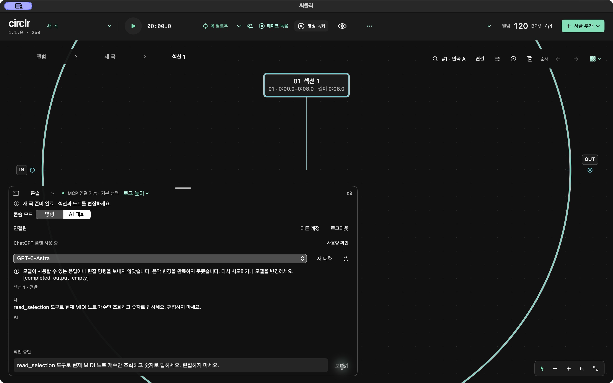
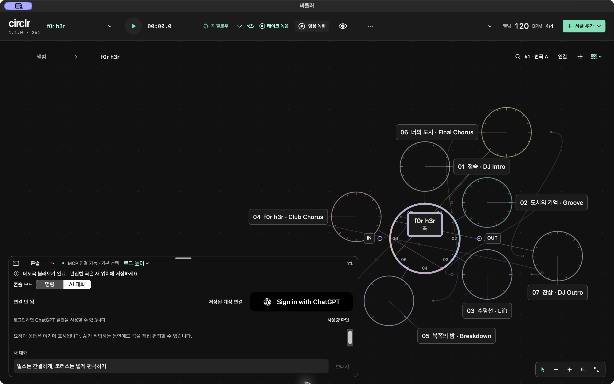
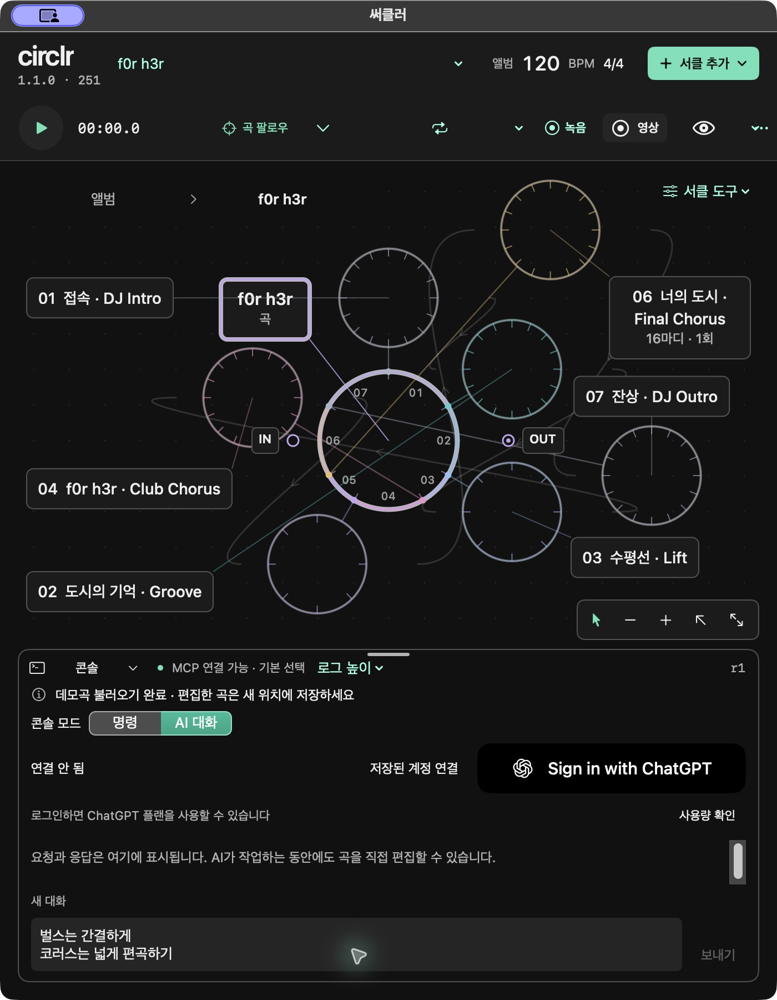

# 1.1 계정·대화 통합 QA

상태: IN_PROGRESS · 미출고 · 후보1.1.0/build251

## 검증 경계

1.0의 보존 브랜치에서 구현을 복원했고 복원 상태의 집중 회귀65개가 통과했다. 이후 수정한 현재 소스와 구분한다. 아래 build246 live 결과는 복원 직후 테스트와 별도로 기록한다.

- 인증 수정: 신규 urn:uuid host, 미등록 legacy host migration, 등록 identity 보존, terminal refresh 오류 분류, direct scope 미동의 안내. SIWCAuth7 + Account15 =22개 PASS (`/tmp/r110-auth-tests-final.log`).
- 응답 수정: 공식 provider 오류9종, bounded16KiB HTTP body, malformed/oversized 및 네트워크 중단 시 오류 보존, 취소 우선. Responses16개 PASS (`/tmp/circlr-r110-provider-tests.log`). 원문 response/token은 사용자 메시지에 전달하지 않는다.
- 음악 도구 수정: 완전 조회 revision에서만 lane 전체 교체, 미조회 노트 보존, 모델이 job 조회를 생략해도 앱이 terminal 상태를 확인. 아래 최종 회귀와 독립 보안 검토에서 확인했다.

## native·실서비스 순서

격리 QA 앱에서 새 곡·선택 MIDI lane→기존 명령/AI 모드·한글 초안 유지·가로/세로 배치→공식 브라우저 로그인→계정/모델 목록→짧은 실제 음악 요청→Undo/바운스/저장→STOP/로그아웃 순서로 확인한다. OAuth 동의가 필요하면 사용자가 권한을 승인하며 자격 증명은 읽거나 출력하지 않는다. 사용자 앱·Codex 인증 저장소·기존 프로젝트는 바꾸지 않는다.

실계정 eligibility 또는 지원하지 않는 인증 조건이 확인되면 구체적인 오류와 재개 조건을 기록한다. fixture나 로그인 버튼 존재로 실제 연결 PASS를 선언하지 않는다.

## build246 통합 및 live 결과

현재 소스 집중 회귀는 Core23 + Codex23 + App35 =81개, 실패0 (`.build/r110-final-integration.log`). 독립 보안 검토는 변경분 actionable0. 배포형 build246과 strict deep 서명 검증이 통과했다.

격리 bundle `com.circlr.build246nativeqa`에서 사용자가 공식 브라우저 동의를 완료한 뒤 앱의 계정 연결 및 실제 모델 목록을 확인했다. GPT-5.6-Luna로 현재 빈 lane에8개 노트를 만들고 바운스하도록 짧은 요청을 한 번 보냈지만 즉시 일반 오류로 중단됐다. 초안은 유지됐으며 실제 음악 편집 성공을 주장하지 않는다. 오류 경로를 구분할 수 있는 안전한 진단 코드가 부족해 보완 후 재검한다. 동의 화면·토큰·개인 프로필을 공개 repo evidence로 포함하지 않는다.

## build247 진단 보완

HTTP 상태, 제한된 오류 code·param, 고정 내부 오류 식별자를 표시한다. 원문 message·body·header는 전달하지 않으며 식별자는 최대96bytes ASCII 허용 문자로 검증한다. Responses18개와 Session16개 테스트가 통과했고 독립 보안 변경분 검토에서 blocker0이었다. 로그: `/tmp/circlr-r110-provider-diagnostics-tests.log`, `/tmp/circlr-r110-session-diagnostics-tests.log`. 실제 요청 재검은 진행 중이다.

Native build247에서 동일한 QA bundle의 저장 계정 연결과 실제 모델 목록 재조회가 성공했다. 동일한 요청 재검은 `invalid_response`로 실패했다. HTTP 거절이 아닌 응답 처리 단계의 문제이며 구체적인 단계는 아직 미확정이다. 음악 편집·바운스 PASS는 보류한다.

Build248 live 진단: `response_content_type_missing`. HTTP 성공 응답에서 Content-Type이 없어 첫 body를 읽기 전에 차단했다. 헤더가 누락된 경우 bounded SSE 구조·완료·tool 검증으로 확인하는 수정을 진행하며 명시적인 다른 Content-Type은 계속 거부한다.

Build249에서는 Content-Type 누락 차단을 해소했지만 Luna 음악 요청과 Astra 읽기 전용 요청 모두 도구 호출·가시 응답 없이 완료 표시됐다. 실제 편집 증거가 없으므로 FAIL이며, completed 메시지 텍스트 fallback과 빈 결과 성공 차단을 보완한다. 헤더 수정 테스트22개 및 독립 검토는 PASS.

Build250 수정: 최종 assistant output_text fallback, 누적64KiB 제한, 빈 결과3종 오류와 초안 보존, 음악 편집 없는 텍스트 결과의 성공 문구 분리. Session19개 PASS (`/tmp/circlr-r110-session-empty-tests.log`), 독립 변경분 검토 blocker0. 실제 결과 재검 대기.

## build250 확인 및 사용자 보류

최종 집중 회귀 Core23 + Codex29 + App40 =92개 PASS (`.build/r110-build250-integration.log`). native Astra 요청에서 `completed_output_empty`가 표시됐고 초안과 revision0이 유지됐다. 실제 MIDI 편집·바운스는 미통과다. 사용자가 OpenAI 서비스 문제를 의심하여 다른 작업 우선을 지시했으므로 추가 호출을 멈췄다. 외부 장애 확정이나 1.1 출고를 주장하지 않는다.

이 이미지는 격리 QA 앱1440×900pt의 실제 화면이며 계정 식별자·동의 화면·토큰은 포함하지 않는다.

## build251 독립 UI 개선

계정 작업을 메뉴로 통합하고 모델명·scope·status를 제한된 줄 안에 표시한다. 긴 오류는52pt 스크롤 영역, 빈 대화는40pt로 줄였고 기존 사용자 대화 높이40…180pt를 존중한다. `circlr.console.mode`로 모드를 보존해 창 크기 변경 때 명령 모드로 돌아가는 결함을 수정했다.

- PASS: 배포형 build251, strict deep codesign, 브랜드 자산 테스트1개 (`.build/r110-console-layout.log`), 독립 UI 리뷰 blocker0.
- Native PASS: 실제 동봉 f0r h3r에서1440×900→700×900pt 왕복, AI 모드와 초안 유지. Ctrl+grave 접기/펼치기 후 모드·여러 줄 초안 유지. 계정 미연결에서 Cmd+Return 전송 차단. 로그인 버튼·입력·상단 컨트롤 겹침 없음.
- OPEN: 로그인 상태의 새 계정/모델 메뉴 및 긴 오류 끝부분 키보드 접근은 서비스 재검 때 확인한다. 한국어 문자열은 AX setValue로 넣었으므로 실제 IME 조합 검증을 주장하지 않는다. 전송/STOP 실서비스는 사용자 보류 상태다.
- 추가 OpenAI 연결·모델 호출은 실행하지 않았다. 1.1은 개발 후보이며 정식 릴리스가 아니다.

촬영: source-built 격리 QA build251, 실제 동봉 데모·정지 상태·미연결 콘솔. 사용자의 원본 프로젝트·설치 앱·오디오 설정은 변경하지 않았다.
